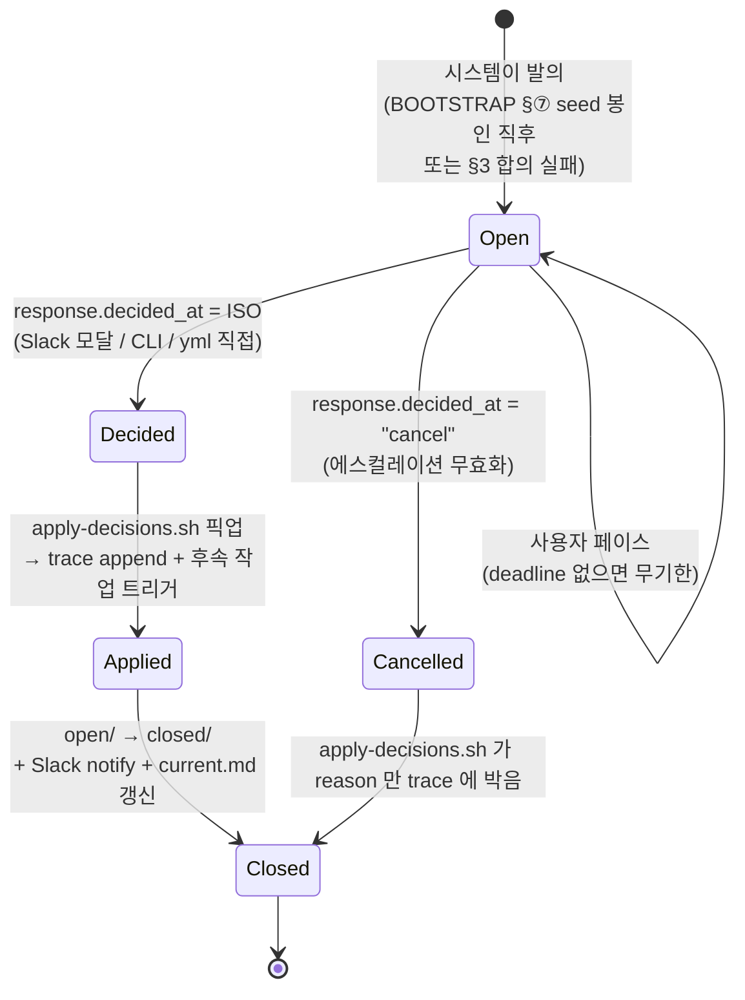
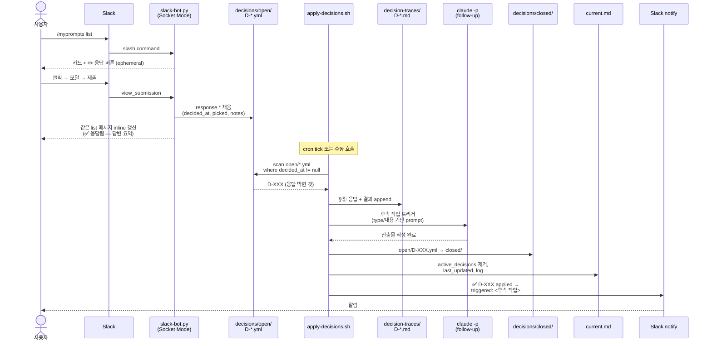
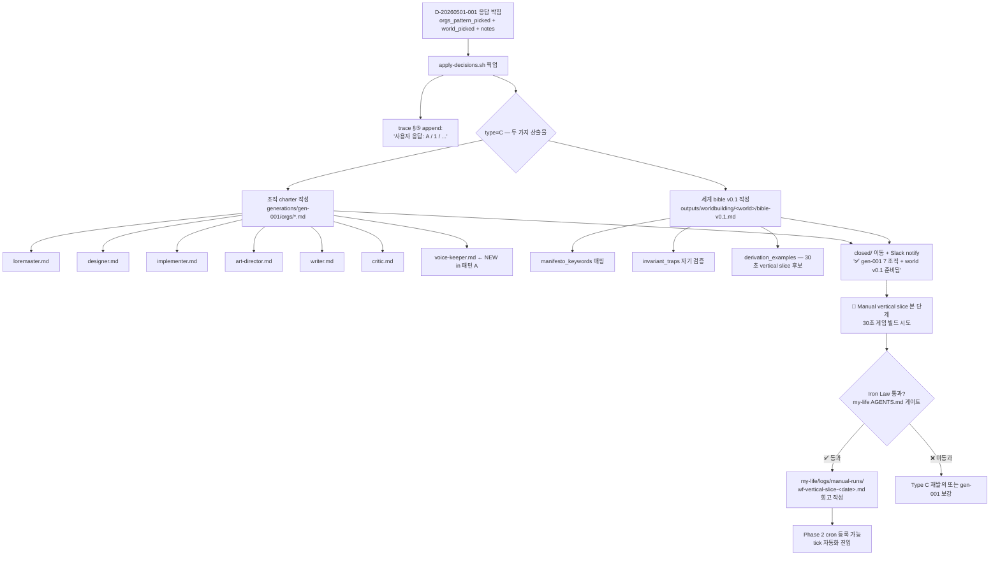

# Decision Flow — HITL 응답 이후 시스템이 하는 일

> 사용자가 `decisions/open/D-*.yml` 의 `response.decided_at` 을 채운 *그 다음 순간* 부터,
> 그 결정이 실제 산출물로 흡수되어 사라질 때까지의 자동화 흐름.

본 문서는 두 갈래로 나뉜다.
- **§1–3** 일반 (Type-agnostic) 흐름 — 모든 결정에 공통.
- **§4** D-20260501-001 (Type C) 특수 follow-up — 첫 결정.
- **§5** 현 시점 구현 현황 — 무엇이 동작하고, 무엇이 다음 세션 작업인지.

---

## 1. 결정의 일생 (state diagram)

| 상태 | 어디서 보이나 | 누가 옮기나 |
|------|---------------|-------------|
| **Open** | `decisions/open/D-*.yml` (`decided_at: null`) | 시스템 (`tick.sh` 의 claude prompt) 이 발의 |
| **Decided** | 같은 파일, `decided_at` 채워짐 | 사람 — Slack 모달 / `respond.sh` CLI / yml 편집 |
| **Applied** | trace md 가 길어지고 follow-up 산출물 작성됨 | `apply-decisions.sh` (cron tick 의 step 1 또는 수동) |
| **Closed** | `decisions/closed/D-*.yml` | 같은 스크립트, 마지막 단계 |

---

## 2. 응답 → 적용 시퀀스

**주의**
- Slack 모달 응답이 *유일한* 응답 경로가 아니다. `respond.sh D-XXX key=value …` (CLI) 또는 yml 직접 편집도 동일 결과 (`decided_at` 박힘) → apply 가 동일하게 픽업.
- apply 는 *멱등* — 같은 결정 두 번 픽업되어도 trace 에 중복 append 만 되고 closed/ 이동은 한 번.

---

## 3. apply-decisions.sh 의 책임 (단계별)

| # | 단계 | 입력 | 출력 |
|---|------|------|------|
| 1 | **스캔** | `decisions/open/D-*.yml` 전부 | `decided_at != null` 인 파일 목록 |
| 2 | **trace append** | yml 의 response + recommended | `decision-traces/D-*.md` 끝에 §⑤ "응답 + 결과" |
| 3 | **follow-up 생성** | yml 의 type / picked / response_schema 매핑 | `claude -p` prompt (D 의 의도를 산출물로) |
| 4 | **claude 호출** | prompt + budget cap | 산출물 (orgs/*.md, outputs/, …) |
| 5 | **이동** | open/D-XXX.yml | closed/D-XXX.yml |
| 6 | **current.md 갱신** | yml id | `active_decisions` 에서 제거, `last_updated` |
| 7 | **알림** | 위 결과 요약 | `slack-notify.sh adhoc "D-XXX applied …"` |

### Type 별 follow-up 형태

| Type | picked | follow-up |
|------|--------|-----------|
| **A** (Go/No-Go) | yes / no / hold | yes → 보류 task 활성화 / no → 백로그 제거 / hold → 다음 사이클 재논의 |
| **B** (옵션 1택) | A / B / C / … | 선택된 옵션의 description 을 prompt 로 산출물 작성 |
| **C** (전략) | response_schema 의 모든 필드 | 다중 산출물 — 본 결정의 모든 의미를 흡수해야 함 (D-001 참조) |

---

## 4. D-20260501-001 (Type C) follow-up 트리

> 첫 결정. **두 묶음** (조직 + 세계) 을 한 번에 다룬다. apply 가 두 산출물 가지를 동시에 트리거.

`notes` 가 비어있지 않으면 apply 는 그것을 prompt 의 *추가 지시* 로 통째로 전달한다 (예: `A_modified` 의 경우 user 의 자유 텍스트를 charter 에 반영).

---

## 5. 현 구현 현황

| 단계 | 파일 / 스크립트 | 상태 | 비고 |
|------|------------------|------|------|
| 발의 (BOOTSTRAP §⑦) | tick.sh 의 claude prompt | ✅ | D-001 은 사람이 손으로 발의함 |
| Slack 모달 응답 | `scripts/slack-bot.py` | ✅ | response_schema 기반 동적 폼, response_url 로 inline 갱신 |
| CLI 응답 | `scripts/respond.sh` | ⬜ | yml safe 편집 헬퍼. fcntl 락 필수 (봇과 경합 회피) |
| 응답 픽업 + trace + follow-up + 이동 + 알림 | `scripts/apply-decisions.sh` | ⬜ | **다음 세션 1 순위.** 본 문서 §3 의 7 단계 구현 |
| tick.sh 보강 — sanity 에 `no_active_org` 추가 | `scripts/tick.sh` | ⬜ | apply-decisions 호출을 BOOTSTRAP §1 단계로 통합 |
| D-001 후속 작업 (수동 vertical slice) | `generations/gen-001/orgs/`, `outputs/worldbuilding/` | ⬜ | apply 통과 후 진행 |
| manual-run 회고 | `my-life/logs/manual-runs/wf-vertical-slice-<date>.md` | ⬜ | Iron Law 게이트 |
| Phase 2 cron 등록 | `BOOTSTRAP.cron.example` 적용 | ⬜ | 위 회고 통과 후에만 |

### 지금 응답하면 무슨 일이 벌어지나 (정직하게)

- `response.*` 가 yml 에 박힌다. ✅
- 그 외엔 **아무 일도 일어나지 않는다.** apply-decisions.sh 가 없으니 아무도 픽업 안 함.
- 사용자가 다음에 새 chat 으로 *"D-001 응답 박혔으니 진행"* 같이 요청해야 AI 가 수동으로 §3 의 7 단계를 한 번 실행하게 된다.
- 이 수동 1 회 실행이 manual vertical slice 본 단계 — 결과를 보고 `wf-vertical-slice-<date>.md` 에 회고 → Iron Law 통과 → 그제서야 cron 자동화 진입.

이 순서가 의도된 *Iron Law* 다 — 검증 안 된 워크플로우는 cron 에 등록하지 않는다.

---

## 참고

- 결정 형식: `decisions/template.yml`, `decisions/open/D-*.yml`
- BOOTSTRAP §0 sanity, §1 응답 통합, §⑦ seed 봉인 후 동작 — `BOOTSTRAP.md`
- 진행 단계 표 — `CHARTER.md` §9
- Slack 트리거 정의 — `docs/slack-triggers.md`
- Cron 등록 / 정지 절차 — `docs/cron-operations.md`
