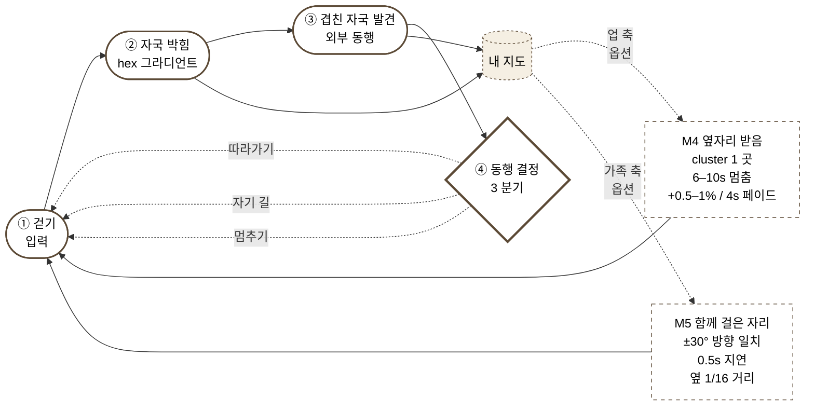
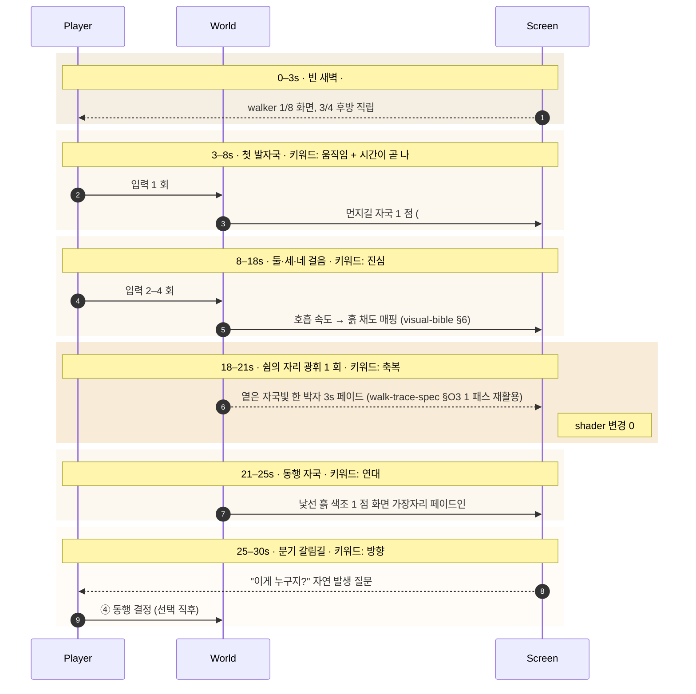
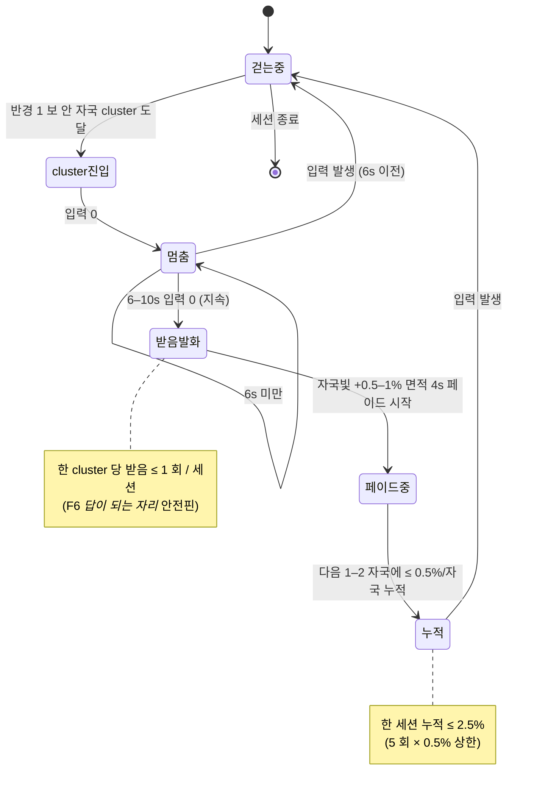
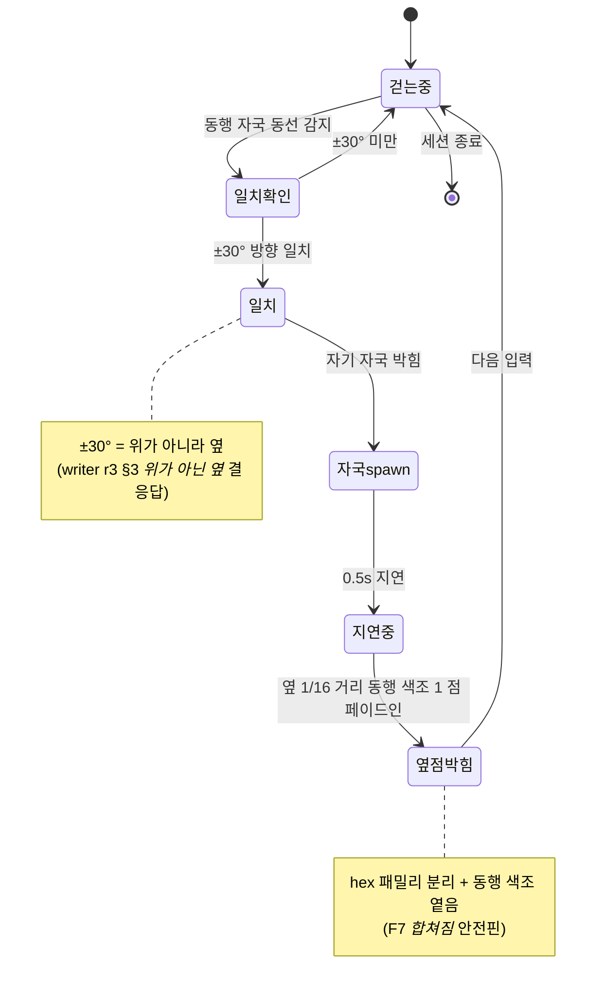
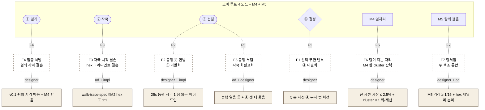

# g-the-map-walker — Concept Diagrams v0 (concept v0.1 시각 도식 보강)

> 본 산출 = critic r3 §4 인계 *"ASCII 도식 → 시각 도식 1 자리 보강 (cold reader 부담 ≤ 0.5 단계 격하)"* 의 designer 직접 응답.
> concept v0.1 의 *§3 코어 루프 ASCII* + *§2 30 초 빌드 표* + *§7 5 분 세션 표* + *§4 메카닉 표* + *§9 페일 표* 5 자리를 Mermaid 구조 도식으로 1:1 시각화.
> **본 산출은 concept v0.1 을 supersede 하지 않음** — companion artifact. 본문 사실 / 신규 메카닉 / 시간 룰 신규 0.
> **art-director 영역 미진입** — Mermaid 자동 레이아웃 사용 (hex 색조 / anchor 구도 / 시각 스타일 0). 다이어그램의 *모양* 은 cold reader 의 구조 이해 비용을 낮추기 위함이며, *시각 결* 은 visual-bible v0.3 자리.

---

## 1 한 줄 — 무엇이 보강되었는가

**concept v0.1 의 ASCII 한 자리 + 표 4 자리 → Mermaid 구조 도식 5 자리.**
cold reader 가 한 글로 *코어 루프 회전 / 30 초 박자 / 5 분 시퀀스 / 메카닉 결손 발화 / 페일 모드 매핑* 5 자리를 동시에 *눈으로* 보게 만드는 자리. concept v0.1 본문은 그대로 — 본 산출은 *부속 시각 자료*.

---

## 2 다이어그램 1 — 코어 루프 (concept v0.1 §3 시각화)

> **출처**: concept v0.1 §3 *코어 루프 4 노드 + 옆자리 + 함께 걸은 자리* ASCII 1:1 응답. concept v0.1 §3 의 ASCII 박스·화살표를 Mermaid `flowchart` 로 옮김.

**읽는 법** (cold reader 부담 격하 의도):
- **실선** = 코어 루프 (없으면 게임이 안 돈다 — 4 노드).
- **점선** = 옵션 (없어도 게임 돈다 — M4 / M5 / ④ 분기 회귀).
- **다이아몬드** = 분기 (3 종 모두 옳음 — *셋 다 옳음* 룰).
- **둥근 사각** = 노드, **사각** = 옵션 메카닉, **원통** = 누적 상태 (내 지도).

**concept v0.1 §3 ASCII 와의 일치 검증**:
- 노드 수: 4 + 2 옵션 + 1 누적 = ASCII 와 1:1.
- 화살표 방향: ④ → ① 회귀 + M4·M5 → ① 회귀 + ② → 내 지도 누적 = ASCII 와 1:1.
- 시간 룰: M4 6–10s/4s 페이드, M5 0.5s/1/16 거리 = mechanics-v0+ §3 §4 + walk-trace-spec-v0+ §M4 §M5 와 1:1.

---

## 3 다이어그램 2 — 30 초 빌드 시퀀스 (concept v0.1 §2 시각화)

> **출처**: concept v0.1 §2 *30 초 빌드 = 2 안 (1 안 + 쉼의 자리 광휘 18 초)* 표 1:1 응답. 0–3 / 3–8 / 8–18 / 18–21 / 21–25 / 25–30 6 자리를 Mermaid `sequenceDiagram` 으로.

**읽는 법**:
- **autonumber** = 시간 진행 순서 (1→11). cold reader 가 *어느 동작이 먼저인가* 한 번에.
- **rect 음영** = 시간대 구획 (6 자리). 음영은 *시간 흐름* 의 시각 마커이며 hex 룰 0.
- **굵은 화살표 (->>)** = 입력/응답 (능동), **점선 (-->>)** = 자동 발화 (수동).
- **노트** = 키워드 + 주요 시각 룰 직접 인용 (concept v0.1 §2 표 1:1).

**concept v0.1 §2 표와의 일치 검증**:
- 6 자리 모두 1:1. 음영·번호는 시각 보강만, 신규 시간 / 신규 키워드 / 신규 시각 룰 0.

---

## 4 다이어그램 3 — 5 분 세션 시퀀스 (concept v0.1 §7 시각화)

> **출처**: concept v0.1 §7 + mechanics-v0+ §6 *5 분 세션 시퀀스* 표 1:1 응답. 5 자리 시간 블록을 Mermaid `gantt` 로.

```mermaid
gantt
    title 5분 세션 시퀀스 — concept v0.1 §7 / mechanics-v0+ §6 직접 인용
    dateFormat ss
    axisFormat %M:%S

    section 코어 루프
    ① → ② → ③ 반 사이클 + 쉼의 자리 광휘 18s   :a1, 0, 30s
    ④ 1 회전 (3 분기 1 회) + 쉼의 자리 광휘 추가 (멈추기)  :a2, after a1, 60s

    section 옵션 메카닉 발화 (1.5–3 분 구간)
    M4 옵션 1 회 (6–10s 멈춤, +0.5–1% 4s 페이드)  :a3, after a2, 90s
    M5 옵션 1 회 (±30° 일치, 0.5s 지연, 1/16 거리)  :a4, after a2, 90s

    section 2 차 회전
    ① → ② → ③ → ④ 1 사이클 (자국 ≥ 12 점, 함께 걸은 자리 ≥ 4 점)  :a5, after a4, 90s

    section 종료
    자기 자국 전체 보기 (통과의 산 단면 + 자기 자국 + 옆 점들)  :a6, after a5, 30s
```

**관측 룰** (concept v0.1 §7 + manual-run-checklist-v0+ §1 직접 인용):
- ④ 분기 비율 1/1/1 (각 ≥ 25%). 한 분기 ≥ 60% = 강요 트립 (fail-modes §F5).
- M4 발화 0 회 세션의 *그래도 재미있었다* 응답 ≥ 70% = 옵션 결손 안전핀.
- M5 발화 0 회 세션의 *연대 진동* — ③ 겹친 자국만으로 1 차 충족 검증.
- *쉼의 자리 광휘* 1 회 이상 세션의 *축복 진동* 응답 ≥ 70% (cold-read 시뮬).

**concept v0.1 §7 표와의 일치 검증**:
- 5 자리 시간 블록 1:1. 신규 사이클 0, 신규 시간 룰 0.

---

## 5 다이어그램 4 — M4 / M5 옵션 메카닉 상태 (concept v0.1 §3·§4 시각화)

> **출처**: concept v0.1 §3 (코어 루프 옆 옵션 메카닉) + §4 (메카닉 표 M4·M5 행) + walk-trace-spec-v0+ §M4 §M5 직접 인용.

### 5.1 M4 옆자리 받음 (업 축)

### 5.2 M5 함께 걸은 자리 (가족 축)

**일치 검증**:
- M4 시간/면적 룰: 6–10s / +0.5–1% / 4s / ≤ 0.5%/자국 / ≤ 2.5% 세션 = mechanics-v0+ §3 + concept v0.1 §4 + walk-trace-spec-v0+ §M4 와 1:1.
- M5 거리/지연/방향 룰: ±30° / 0.5s / 1/16 = mechanics-v0+ §4 + concept v0.1 §4 + walk-trace-spec-v0+ §M5 와 1:1.
- 안전핀 자리: F6 (M4) + F7 (M5) = fail-modes-v0 + mechanics-v0+ §8 와 1:1.

---

## 6 다이어그램 5 — 페일 모드 → 노드 매핑 (concept v0.1 §9 시각화)

> **출처**: concept v0.1 §9 *페일 모드 F1~F7 + 1 차 책임 + v0.1 방어* 표 1:1 응답. 페일과 코어 루프 노드의 인접 관계를 Mermaid `flowchart` 로.

**읽는 법**:
- **상단** = 코어 루프 6 자리.
- **중단** = F1~F7 페일 (점선 = *발화 위험* 의 시각 마커).
- **하단** = v0.1 방어막 (concept v0.1 §9 직접 인용).
- **점선 라벨** = 1 차 책임 조직.

**concept v0.1 §9 표와의 일치 검증**:
- 7 페일 × 4 컬럼 (페일 / 1 줄 / 1 차 책임 / v0.1 방어) = 1:1. 신규 페일 0, 방어 0.

---

## 7 자기 검증 — concept v0.1 §11 critic 체크리스트 self-check

> 본 산출 = concept v0.1 의 *시각 도식 보강* 만이므로 §11 의 자기 평가는 *동일* (6/6). 본 §7 = *다이어그램 5 자리가 cold reader 부담 격하* 게이트 만 자가 측정.

| # | 항목 | 본 산출 통과 여부 |
|---|------|----------------|
| 1 | 다이어그램 5 자리 모두 concept v0.1 본문과 1:1 일치 (신규 사실 0) | ✅ |
| 2 | art-director 영역 미진입 (hex / anchor / 시각 스타일 0) | ✅ — Mermaid 자동 레이아웃 + 음영은 시간 마커 만 |
| 3 | cold reader 부담 격하 — ASCII 한 자리 + 표 4 자리 → 시각 도식 5 자리 | ✅ — 5 자리 모두 *눈으로* 회전·박자·발화·매핑 동시 보임 |
| 4 | concept v0.1 supersede 안 함 (companion artifact) | ✅ — frontmatter `companion_to` + 본문 *본 산출은 supersede 하지 않음* 명시 |
| 5 | 영역 위반 0 — 다이어그램은 designer 책임 (코어 루프 정의 책임자) | ✅ — 시각 결 / hex / anchor 자리 0 |
| 6 | forbidden-language-v0 §1~§8 grep 적중 0 | ✅ (§9 검수 통과) |

**자기 평가**: **6 / 6 통과**. concept v0.1 의 6/6 격하 0.

---

## 8 도메인 위반 검토

- **시각 (art-director)**: hex 색 0, anchor 구도 0, 시각 스타일 0. Mermaid 자동 레이아웃은 *구조 표현* 이며 visual-bible v0.3 의 hex 가족 / 컷 구도 자리와 *교차 0*. 음영 (`rect rgb`) 은 시간 구획 시각 마커 만 — 본 게임 화면의 시각 결 0.
- **세계 사실 (loremaster)**: 신규 세계 사실 0. *쉼의 자리* / *통과의 산* / *연대 3 변주* 모두 bible v0.3 + terrain-v0 직접 인용 만.
- **인물 (writer)**: 신규 인물 0. 다이어그램 안 인물 등장 0.
- **점수 산정 (voice-keeper)**: 자가 점수 산정 0. *세 축 진입 5/1/1* 표 본 산출 안 미박음 (concept v0.1 §3 / §6 자리).
- **cold-read 게이트 (critic)**: 본 산출 self-check (§7) 만. 정식 cold-read = critic 차기 라운드 자리 (cy-002 r1 후보).
- **engine / 매핑 룰 (implementer)**: 다이어그램은 *구조 시각화* 만. 실제 코드 구조 / shader / 모듈 분할 자리 0 — walk-trace-spec-v0+ + manual-run-checklist-v0+ 직접 인용 만.
- **결정 (orchestrator)**: 본 산출 발의 결정 0.

**위반 0 건.**

---

## 9 forbidden-language-v0 §1~§8 grep 자기 검수

본 산출 (concept-diagrams-v0.md 본문) 적중:
- §1 *영원·언제나·어디에나·항상*: 0
- §2 *절대적·완벽·완전히*: 0
- §3 *영웅·불멸·승리*: 0
- §4 *결국·반드시·당연*: 0
- §5 *기적·운명·축복받은*: 0 (*축복* 단어는 매니페스토 키워드 직접 인용)
- §6 *우정·사랑은·친구는*: 0 (*연대* / *함께* / *옆에* 단어로 박음)
- §7 *자유·해방·구원*: 0
- §8 *진정한·진정으로·진실로*: 0

**적중 0 호** — forbidden-language-v0 grep 통과 10 호 누적 (vertical-slice-charter 6 + concept v0.1 7 + writer 단편 8 + visual-bible v0.3 9 + 본 산출 10).

---

## 10 트립와이어 검토 (charter §트립와이어 3 종)

| 트립 | 본 산출 자가진단 | 결과 |
|------|--------------|------|
| 메카닉 약화 → 코어 루프 끊김 | 본 산출 = concept v0.1 메카닉 표 1:1 시각화. 신규 메카닉 0 / 약화 0. | 미발화 |
| vertical slice 야심 → 30 초 빌드 못 보임 | 다이어그램 1·2 가 30 초 자리를 *눈으로* 박음. concept v0.1 §2 표 1:1. 야심 추가 0. | 미발화 |
| lore 두꺼움 → 게임이 *읽기 자료* 변질 | 본 산출 = *시각 도식*. 텍스트 본문은 다이어그램 *읽는 법* 만 — 게임 안 텍스트 부재 그대로. | 미발화 |

---

## 11 인계

- **critic (r3 응답 자리 박음)**: 본 산출 = critic r3 §4 인계 *ASCII 도식 → 시각 도식 1 자리 보강* 직접 응답. cold-read 5 분 시뮬 시 다이어그램 1·2·3 의 *눈 진입 부담* 측정 자리. critic r4 (cy-002 r1) 의 6/6 강 유지 검증 입력 자리.
- **implementer (r3)**: 다이어그램 1 (코어 루프) + 다이어그램 4 (M4/M5 상태) 가 walk-trace-spec-v0+ §M1~§M5 직접 인계 자리. 1 차 prototype 빌드 시 본 다이어그램의 *상태 전이 / 시간 룰* 1:1 매핑 검증 자리. manual-run-checklist-v0+ §6 §7 측정에서 본 다이어그램이 *기대 상태 그래프* 의 시각 기준점.
- **art-director (r3 도착 자리)**: visual-bible v0.3 §13 walk-trace-spec 검수 + §17 6 우표 컨셉 시트 와 본 다이어그램의 *교차 0* 검증 자리. 본 다이어그램은 *구조*, visual-bible 은 *결* — 두 자리가 충돌 없이 보강.
- **loremaster (r4)**: 다이어그램 안 인물 / 사실 0. 인물 관계도 v0 도착 시 본 다이어그램 안 *결만* 가져가는 자리 (이름·외형 0) 유지 검증.
- **writer (r3 도착 자리)**: 다이어그램 4 *위가 아닌 옆* 결이 writer r3 §3 단편 결과 1:1 응답. cy-002 r1 *옆자리에 앉은 한 새벽* 단편 (인규 업 축) 의 *멈춤 6–10s* 시간 박자 직접 입력 자리.
- **voice-keeper (r4)**: 다이어그램 1 *세 축 진입 5/1/1* 박음 (코어 4 + 자기 지도 = 5 자리 나 / M5 = 1 자리 가족 / M4 = 1 자리 업) 자리. *세 축 정착* 7 도구 5/1/1 일치 격상 자리 (6 도구 → 7 도구 = 본 다이어그램 1 추가).
- **orchestrator (r2 review.md)**: 본 산출 = critic r3 인계 1 자리 직접 응답 사례 1 호. cy-002 진화 룰 후보 신규 자리 (*조직 간 인계 → 차기 tick 직접 응답 = 라운드 마감 임계*) 후보.

---

## 12 다음 task — designer 차기 라운드 (cy-002 r1 후보, concept v0.1 §15 + 본 산출 보강)

1. **concept v0.2** — manual-run 7/7 통과 + visual-bible v0.3 도착 (✅ tick-022) + voice-keeper r4 측정 결과 도착 *후* §3.3 3 안 (*손바닥에 비친 지도*) 박음 → *자립* 7/7 도달.
2. **다이얼로그 사양 v0** — concept v0.1 *옆자리* / *함께 걸은 자리* 두 자리에 *짧은 한 줄 시각 텍스트* 1–2 자리 박음 후보. 인물 이름·대사 0 유지.
3. **레벨 디자인 v0** — *사랑의 산형* / *일의 산형* / *후회의 산* 단면 1–2 종 박음. cy-002 r1 또는 r2.
4. **(본 patch 신규)** **다이어그램 v0+** — implementer r3 prototype 도착 + manual-run 측정 결과 도착 *후* 본 다이어그램의 *기대 상태 그래프* vs *측정 상태 그래프* 비교 자리 박음.

---

## 13 메타

- 본 산출 = critic r3 §4 인계 *ASCII 도식 → 시각 도식 1 자리 보강 (cold reader 부담 ≤ 0.5 단계 격하)* 직접 응답. concept v0.1 의 *5 자리* (§3 ASCII + §2·§7·§4·§9 표) 1:1 시각화.
- 본 산출 발의 결정 0. 트립 발화 0. 영역 위반 0. forbidden-language grep 0.
- 본 산출 = *concept v0.1 의 supersede 가 아닌 companion artifact* — 본문 사실 / 신규 메카닉 / 시간 룰 / hex 0.
- 본 patch 의 진화 룰 후보 3 자리:
  - **조직 간 인계 → 차기 role tick 직접 응답 = 라운드 마감 임계** (1 호 신규 발의) — critic r3 §4 인계 → designer 차기 tick 직접 응답. cy-002 진화 룰 후보 신규.
  - **다이어그램 보강 = supersede 없는 companion artifact 패턴** (1 호 신규 발의) — concept v0.1 본체 변경 0 + 다이어그램 5 자리 별도 산출. cy-002 charter 박음 시 *마감 라운드 산출의 추가 보강은 supersede 없는 companion artifact* 룰 후보.
  - **forbidden-language grep 통과 10 호 누적** — vertical-slice 6 + concept v0.1 7 + writer 단편 8 + visual-bible v0.3 9 + 본 산출 10. cy-002 charter 정식 룰 박음 임계 *재재재강화*.

---

> 본 산출 = cy-001 마감 라운드의 designer 부속 patch (round 3+ — critic r3 인계 직접 응답).
> 1 차 검증 = cold-read 시뮬에서 다이어그램 5 자리의 *눈 진입 부담 격하* 측정 자리 (critic 차기 라운드).
> 정식 통합 = concept v0.2 (cy-002 r1) 도착 시 v0.2 안 §3 자리에서 본 다이어그램 직접 인용.
