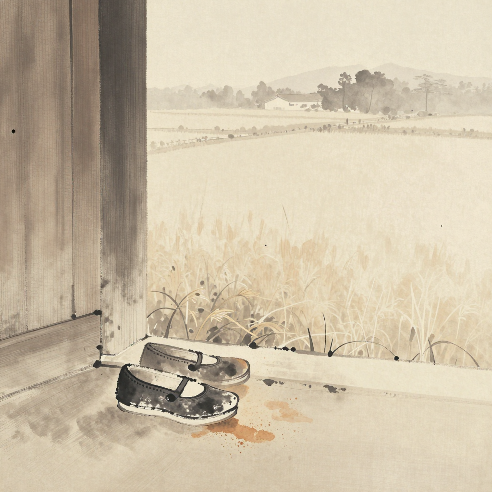
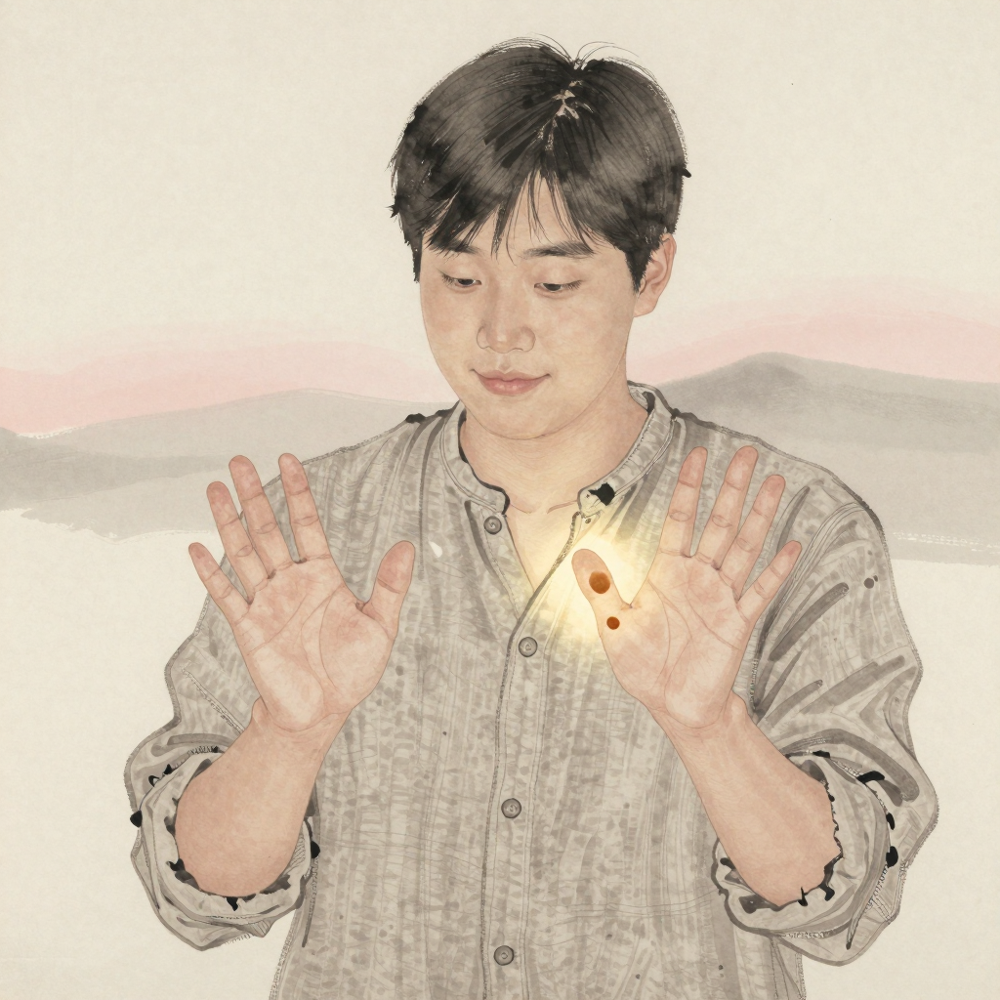
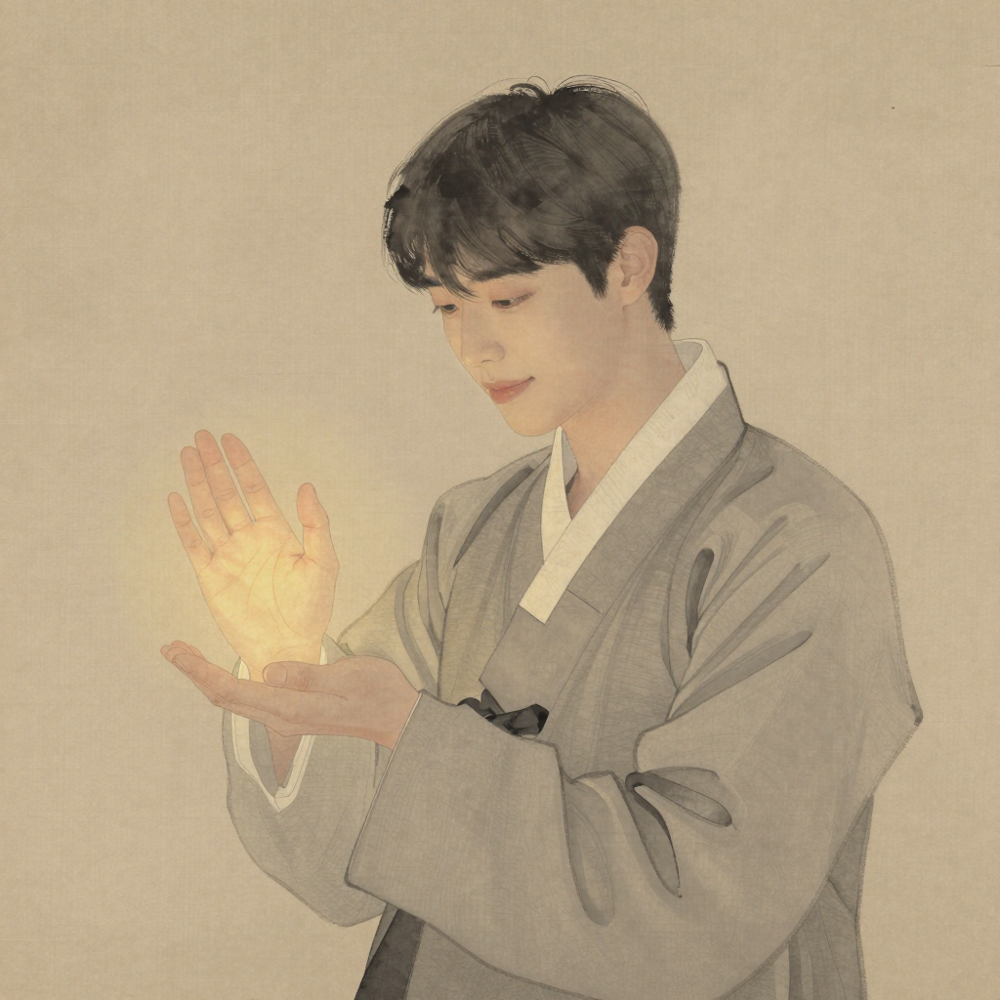

# 해온 (海溫) — *손금 새벽을 매일 하는 자*

## 한 줄

매일 새벽, 손바닥을 펴는 것이 *습관* 이 된 사람. 14 자국째 해 부터 하루도 빠뜨리지 않았다.

## 자리 (terrain × chronicle)

| 항목 | 값 |
|------|-----|
| 축 | 나 |
| 자국째 해 (현재) | 27 (14 자국째 부터 매일) |
| 손금 새벽 | 매일 30 분 |
| terrain | 분포 (큰 산 ≠) |
| 누적 시간 | 13 년 |
| 1 차 chronicle 사건 | 사건 3 *낯선 흙 색조 1 점 발견* — 5 자국째 익명 자국 |

## 일상 풍경

변두리의 한 줄 골목. 새벽 다섯 시 반, 가로등이 아직 켜져 있고 옆집 문 닫히는 소리가 들린다. 손바닥을 펴는 30 분 동안 창밖으로 도시 한복판으로 가는 첫 버스가 한 대 지나간다. 평지 끝에 옅게 깔린 흙은 사방으로 옅어지지만, 매일 같은 자리에 같은 한 점이 다시 박혀 있다.

## 동기

자기 지도가 *어제와 오늘 사이에 어떻게 변했는지* 의 미세한 결을 본다. 큰 모양은 거의 그대로지만 가장자리의 옅은 흙이 매일 미세하게 다르다. 그 차이를 본다.

거기엔 *놀람* 도 *기쁨* 도 *낙담* 도 있지만, 14 자국째 해 부터는 *기다림* 이 많다 — 어제는 안 보였던 한 점이 오늘은 보일까. 보지 않는 새벽이 무서운 게 아니라, 안 보면 그 한 점을 모르고 지나갈까봐.

## 말버릇 / 표정

짧은 문장. 결론보다 관찰. *"~인 것 같아"* 보다 *"오늘은 그렇게 보였어"*. 단정하지 않는다 — 자기 지도조차 매일 다르게 보이는데 다른 무엇이 단정될 수 있겠는가.

웃을 때 어깨가 먼저 들썩인다. 소리는 작다. 새벽의 방을 깨우지 않는 습관.

## 자기에게 쓰는 시간

매 새벽 30 분, 손바닥. 그 외 시간은 *바깥* 에 쓴다 — 흙을 박는 일, 다른 사람의 자국 옆을 지나는 일. 자기 지도를 *오래 들여다보는* 일은 새벽 30 분으로 충분. *시간을 자기에게 쓴다* 는 것이 *자기 안에 머문다* 는 의미가 아니라 *자기를 매일 한 번 본다* 는 의미라고 — 본인은 명시한 적 없지만 그렇게 산다.

## 겹친 자국 1 점

해온의 손바닥에는 *5 자국째 해* 의 어느 새벽부터 다른 색조의 흙 한 점이 박혀 있다. 누구의 발자국인지 모른다. 매일 같은 자리에 있다. 14 자국째 해 동안 옆을 지난 그 사람을 만나려 한 적은 없다. *겹쳐진 사실* 이 *겹친 사람* 보다 먼저였고, 본인에게는 그게 더 중요하다.

> 후보 1 인 = 유리 (character-relations-v0 §3.2 #8 — *익명* 자리, 박지 않은 채 둠).

## 다른 인물에 대한 한 줄

- **정해에 대해**: *"그가 한 번도 펴지 않은 게 무서운 일이라곤 생각 안 해. 그도 자기 방식으로 매일 보고 있을 거야 — 발끝으로."*
- **나림에 대해**: *"한 번 본 사람은 두 번째 새벽을 받을 자격이 있어. 그건 두려워해도 되는 일이야 — 그저 두려움이 지도를 작게 만들지는 않으니까."*

## 외형 / 분위기

- **나이**: 27 자국째 해 (청년 후반 — 14 자국째 부터 매일 새벽이 13 년 누적)
- **분위기**: 차분, *새벽의 방을 깨우지 않는* 결. 움직임이 작고 조용하다.
- **자세**: 어깨가 먼저 들썩이는 짧은 웃음 — 소리는 작다.
- **종이**: 분포 형 — 큰 산 없음, 가장자리 옅은 흙
- **hex 색조** (visual-bible v0.4 §11.2): `#5C4A36` 먼지길 중앙
- **의상 / 체형**: art-director 자리 — 회화 톤 baseline (절제된 한국 동양화 결)

## 시각 단서 (캐릭터 시트 prompt 입력)

- 펴진 손바닥 안 옅은 흙빛 한 점 (5 자국째 익명 자국)
- 새벽의 옅은 빛이 손바닥을 비추는 정면 컷
- 어깨 먼저 들썩이는 짧은 웃음 (표정 시트 1)
- 다른 사람의 자국 옆을 지나는 옆모습 (포즈 시트 1)

## 일러스트 갤러리

| 컷 | 자리 | 출처 |
|-----|-----|------|
|  | §17.1 *(이름 폐기 — 매일 새벽 현관에서 신발 한 켤레를 한 번 본다)* — 김제 변두리의 현관 문턱, 작은 신발 한 켤레 close-up + 신발 끝의 옅은 흙빛 + 들녘 옅은 평지 + 짧은 안개 한 자리 (D-001 vocabulary_shift palm closure carry, supersedes v1) | visual-bible-v0.6 §1·§3 |
|  | 캐릭터 시트 v2 — 27 자국째, 손금 새벽 정면 + 어깨가 먼저 들썩이는 짧은 웃음의 결 (F-1251 응답: 셋 인물 분별 baseline 재측정) | cy-003 r4 art-director image (supersedes v1) |
|  | 캐릭터 시트 v1 — 27 자국째, 손금 새벽 정면 컷 (회화 톤 baseline, superseded) | cy-003 r2 art-director image |

> 확장 자리 (cy-003+ 후보):
> - *5 자국째 익명 자국이 박힌 그 새벽*
> - *어깨 먼저 들썩이는 웃음의 옆모습*
> - *14 자국째 누적의 손바닥 — 13 년의 결이 한 자리에 모인 컷*

## 인접 자료

- 통합 시트: [character-sheets-v0.md §1](../character-sheets-v0.md)
- 관계 그물: [character-relations-v0.md §3.1 #1 (해온 ↔ 인규)](../../../worldbuilding/the-map-is-the-journey/character-relations-v0.md)
- chronicle 매핑: character-relations-v0.md §4 (사건 3 = 5 자국째 익명 자국)

## 트립와이어 자기 검사

| 트립 | 자가 진단 | 결과 |
|------|---------|------|
| #1 매니페스토 7 키워드 직접 인용 | 본 시트 본문·대사 0/7 | 미발화 |
| #2 forbidden-language §1~§8 grep | 적중 0 | 미발화 |
| #3 권력 비극 미끄러짐 | 본 인물 1 차 후보 ≠ (정해의 비극 1 차 후보 / 인규의 옆자리 변주) | 미발화 |
