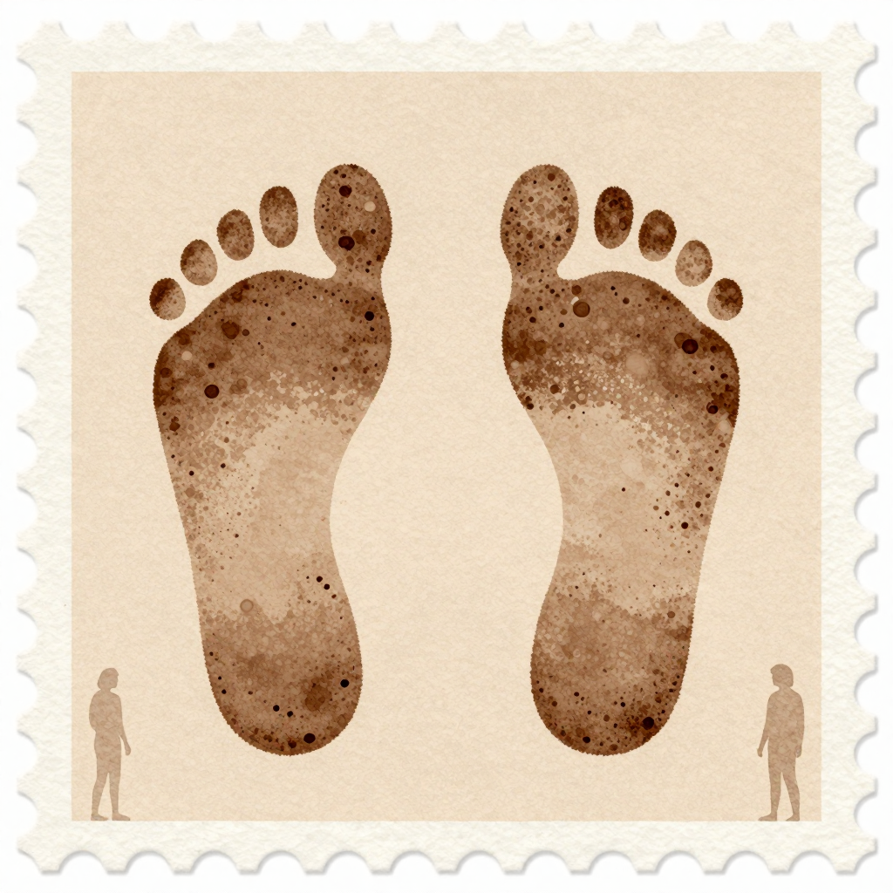

# 희재 (熙在) — *묻지 않은 채 같은 길을 두 번 걸은 사람*

## 한 줄

평생 손바닥을 한 번도 펴 본 적 없는 사람. 정해와 두 번 같은 길을 걸었지만, *내 지도 봤어?* 라고 한 번도 묻지 않았다. 묻지 않은 것이 본인에게는 가까이 있는 결.

## 자리 (terrain × chronicle)

| 항목 | 값 |
|------|-----|
| 축 | 나 |
| 자국째 해 (현재) | 27 (한 번도 안 함, 정해와 동일) |
| 손금 새벽 | 0 (시도조차 안 함 — 정해와 살짝 다른 결) |
| terrain | 발끝 방향 (정해와 두 번 겹침: 17 자국째 + 24 자국째) |
| 누적 시간 | 0 년 누적 |
| 1 차 chronicle 사건 | 정해와의 *나란함* — 사건 1 *처음 백지를 받은 새벽* + 17 자국째 첫 같은 길 + 24 자국째 두 번째 같은 길 |

## 첫 모습

해 질 무렵의 길가에 한 사람이 잠시 멈춰 서 있다. 외투 주머니에 손을 넣은 채 발끝의 방향을 내려다보고 있다. 본인은 길의 갈래에서 자주 멈추지만, 멈추는 시간이 길지는 않다. 한 호흡 들이마시고 발끝이 가리키는 쪽으로 다시 걷는다. 본인은 그 한 호흡을 *고민* 이라고 부르지 않는다. *습관* 이라고도 부르지 않는다. 부를 단어가 없다는 게 본인에게는 가벼운 일이다 — 머쓱한 가벼움이지만, 가벼움인 것은 맞다.

## 동기

본인은 *볼 수 있는데 안 본다* 의 결. 다만 정해와 살짝 다르다 — 정해는 어릴 때 한 번 시도하고 거두었다, 본인은 시도조차 안 했다. 본인은 그것을 *겁* 이라고 부르지 않는다. 부를 단어가 본인에게 없다는 게 본인에게는 자연스럽다.

본인은 정해와 두 번 같은 길을 걸었다. 17 자국째 해의 어느 봄날, 24 자국째 해의 어느 가을. 두 번 다 *내 지도 봤어?* 라고 묻지 않았다. 정해도 묻지 않았다. 두 사람이 같은 자리에 *동시에* 박힌 적은 한 번도 없다 — 시간차는 1 일에서 1 주.

## 자기에게 쓰는 시간

발끝의 방향을 정하는 데 가장 많은 시간을 쓴다. 새벽엔 잔다. 자기 종이를 본 적이 없으니 자기 종이에 쏟는 시간도 0. 그러나 본인은 자기 발끝이 매일 같은 곳을 가리킨다는 것을 안다 — 본 적 없이 안다.

## 말투 (voice-signature)

말이 길지 않다. 한 마디 안에 한 박자만 넣는다. 결론을 박지 않는다 — *~인 것 같아* 보다 *~인 것일 수도 있어* 가 본인의 입에 더 가깝다.

샘플 3 줄:

> *"두 번 걸었으면 충분해. 세 번째는 둘 중 한 사람이 발끝의 방향을 바꾸는 새벽에 일어나겠지."*

> *"그 새벽이 와도 묻지 않을 거야. 묻지 않는 게 가까운 일이야."*

> *"안 본 게 자유의 결인지 겁의 결인지는 본인이 답할 자리지, 내가 답할 자리는 아니야."*

말의 박자: 끝맺음은 *~겠지 / ~인 것일 수도 있어 / ~지*. 한 마디 끝에 가벼운 한숨 한 박자가 자주 있다.

표정: 웃을 때 입꼬리만 살짝 올라간다. 어깨도 눈도 따라 움직이지 않는다. *기쁨* 은 늘 *반쯤 가벼움* 과 함께 와서 — 머쓱한 가벼움.

## 금지 어휘 (per-character forbidden)

- *내 지도 봤어 / 너는 본 적 있어 / 우리 같은 길 걸었나* — 본인은 묻지 않는다.
- *반드시 / 분명히 / 절대* — forbidden-language §3·§7.
- *완전히 / 끝까지 / 마지막까지* — forbidden-language §8.
- *영원히 / 어디에나* — forbidden-language §1·§2.
- 매니페스토 7 키워드 직접 호칭.

## 겹친 자국 1 점

정해의 자국 위에 희재의 자국이 *시간차 1 일 ~ 1 주* 로 박힘. 두 자국 사이의 흙 색조는 두 색조가 나란히 — 두 색조가 합쳐진 것이 아닌 *옆에 박힌* 결.

## 다른 인물에 대한 한 줄

- **정해에 대해**: *"두 번 걸었으면 충분해. 세 번째 새벽이 오면 둘 중 한 사람의 발끝이 바뀌어 있겠지 — 그 새벽도 묻지 않을 거야."*
- **해온에 대해**: *"매일 자기 손바닥을 보는 사람의 새벽도 우리의 발끝 새벽과 결이 닿아 있어. 본인은 안 봐도, 우리는 같은 새벽을 살고 있어."*
- **연강에 대해**: *"오래 옆에 앉아 주는 사람의 결은 옆에 앉아 본 사람만 알아 — 본인은 그 자리에 가까이 가 본 적이 한 번도 없는데, 멀리서 옅게 보였어."*

## 외형 / 분위기

- **나이**: 27 자국째 해 (청년 후반 — 정해와 동일)
- **분위기**: 머쓱한 가벼움 — 답을 박지 않은 채 발끝의 방향이 매일 같은 결
- **자세**: 외투 주머니에 손을 넣은 채 발끝의 방향을 내려다보고 있다. 길의 갈래에서 잠시 멈춤. 한 호흡 후 다시 걸음.
- **종이**: 발끝 방향 (분포 — 정해와 두 번 겹침)
- **hex 색조** (visual-bible v0.4 §11.2): `#3F3525` 진한 정중앙 옅음 (정해 `#3A2D1E` 보다 0.05 폭 옅게 — *시도조차 안 했다* 결의 시각)
- **의상 / 체형**: art-director 자리 — 회화 톤 baseline. 외투

## 시각 단서 (캐릭터 시트 prompt 입력)

- 해 질 무렵 길가 — 외투 주머니에 손을 넣은 정지 (정면)
- 입꼬리만 살짝 올라가는 머쓱한 가벼움 (표정 시트 1)
- 발끝의 방향을 내려다보는 옆모습 (포즈 시트 1)
- 정해와 시간차 1 일 ~ 1 주 같은 길 (관계 컷 후보)

## 일러스트 갤러리

| 컷 | 자리 | 출처 |
|-----|-----|------|
|  | §17.8 *나란히 두 새벽* — 정해의 자국 위에 시간차 1 일 ~ 1 주로 박힌 희재의 자국 | visual-bible-v0.4 §17.8 (PASS 조건부) |

> 확장 자리 (cy-003+ 후보):
> - *해 질 무렵 길가의 정면 — 외투 주머니, 발끝*
> - *머쓱한 가벼움의 입꼬리 클로즈업*
> - *24 자국째 두 번째 같은 길 — 정해와의 시간차 동행 (관계 컷)*

## 인접 자료

- 통합 시트: [character-sheets-extended-v0.md §2](../character-sheets-extended-v0.md)
- 관계 그물: [character-relations-v0.md §2.2 + §3.2 #6 (희재 ↔ 정해 — 묻지 않은 채 같은 길 두 번)](../../../worldbuilding/the-map-is-the-journey/character-relations-v0.md)
- bible §2.3.3 *나란함* 1 차 인물 박음

## 트립와이어 자기 검사

| 트립 | 자가 진단 | 결과 |
|------|---------|------|
| #1 매니페스토 7 키워드 직접 인용 | 본 시트 본문·대사 0/7 | 미발화 |
| #2 forbidden-language §1~§8 grep | 적중 0 | 미발화 |
| #3 정해 짝의 권력 비극 동반 위험 | 본인은 정해의 짝 ≠ 권력자. *시도조차 안 했다* 결로 정해와 분리 박힘 (hex 0.05 폭 옅게) | 미발화 |
