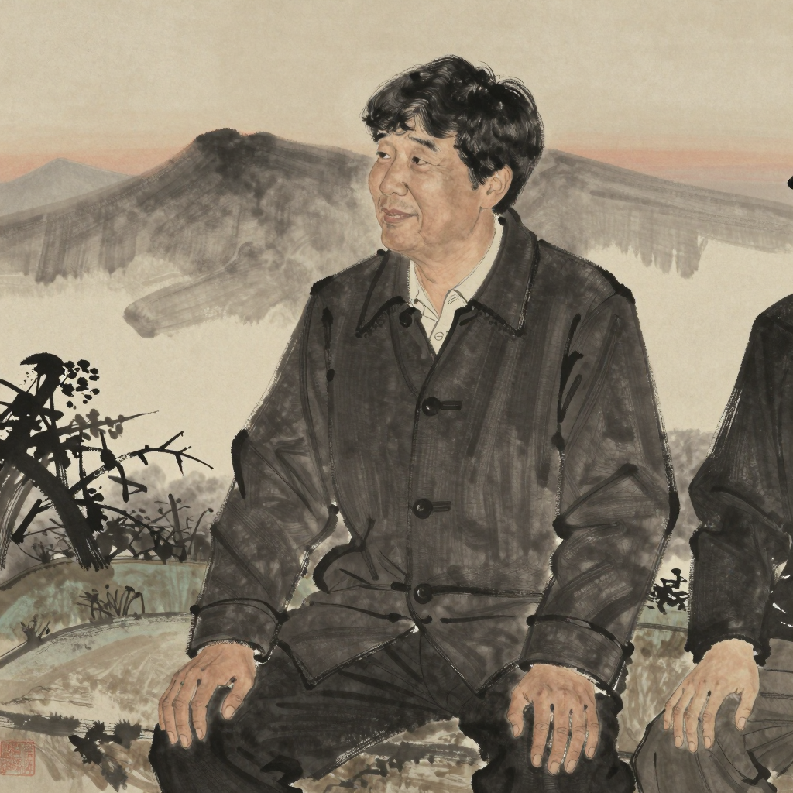

# 인규 (仁圭) — *옆에 앉는 사람*

## 한 줄

본인의 종이 위 큰 산은 *자기가 일한 곳들의 산*. 28 자국째 해 부터 다른 사람의 손바닥이 펴질 때까지 옆에 앉아 있는 일을 했다. 본인은 그것을 *일* 이라고 부르지 *가르침* 이라고 부르지 않는다.

## 자리 (terrain × chronicle)

| 항목 | 값 |
|------|-----|
| 축 | 업 |
| 자국째 해 (현재) | 42 (28 자국째 부터 매일 5 분 + 옆자리 30 분) |
| 손금 새벽 | 새벽 5 분 + 옆자리 30 분 |
| terrain | 통과의 산 가장자리 (옆자리 200 자리) |
| 누적 시간 | 14 년 누적 |
| 1 차 chronicle 사건 | 사건 3 *낯선 흙 색조 1 점 발견* — 28 자국째 *연강 색조* + 사건 4 *지도-스승의 침묵* (28~42 자국째 = 14 년) |

## 동기

본인은 *지도-스승* 이라는 자리를 받아들이지 않는다. 그러나 다른 사람들이 본인을 그렇게 부른다. 본인이 하는 일은 *다른 사람의 손바닥이 펴질 때까지 옆에 앉아 있는 것* — 그것뿐이다. 가르치지 않는다. 답을 박지 않는다. 다만 옆에 있다.

본인의 종이 위 큰 산은 *자기 산* 이 아니라 *옆에 앉은 자리들의 산*. 본인의 *업* 은 *옆에 앉기* 고, 그 자리들이 본인의 산이 되는 것이 본인에게는 *기쁜 결* — 자기 산이 자기 일과 같은 자리에 있다는 게 본인에게는 운이 좋은 일.

## 말버릇 / 표정

묻기를 잘한다. *"네가 본 것이 무엇인지" / "그 자리가 너에게 어떻게 보였는지"*. 본인의 의견을 박지 않는다. 단 *옳지 않다* 고 느낄 때만 한 번 짧게 말한다 — *"그건 아닌 것 같아"*. 그 한 마디가 짧아서 무겁다.

웃을 때 눈만 살짝 좁힌다. 입은 거의 움직이지 않는다 — 옆에 앉을 사람의 새벽을 깨우지 않으려는 습관이 몸에 박힘.

## 자기에게 쓰는 시간

28 자국째 해 부터 새벽엔 손바닥 5 분, 그 후 30 분은 옆에 앉을 사람의 손바닥 옆에 앉아 있는 시간. *내가 무엇인지 보는 것은 매일 5 분이면 된다, 옆에 앉을 사람들의 새벽이 더 길게 본인의 손바닥에 비치기 때문에*.

## 겹친 자국 1 점

본인의 종이의 *큰 산* 이 곧 본인의 *겹친 자국 모임*. 28 자국째 해 부터 14 자국째 해 동안 옆에 앉은 약 200 명의 색조가 그 산 한 자리에 모여 있다. 그 산은 굳어 있고 두껍지만 *방향* 은 사방으로 흩어져 있다 — 가까이 보면 200 개의 작은 화살표가 다 다른 곳을 가리키고 있다.

> 권력자의 산은 *한 방향에만 두꺼운* 모양이고 본인의 산은 *모든 방향이 한 자리에 모인* 모양 — 그 차이를 본인은 매 새벽 5 분 손바닥을 펼 때 잠깐 본다.

## 다른 인물에 대한 한 줄

- **해온에 대해**: *"매일 자기 손바닥을 본다는 것은 본인 종이를 정직하게 사는 결이야. 나는 그 결을 옆에 앉을 사람들에게서 자주 본다."*
- **정해에 대해**: *"안 본다는 게 자유의 결인지 두려움의 결인지는 옆에 앉아 본 사람만이 안다 — 그가 어느 결인지는 본인이 답할 자리고 내가 답할 자리는 아니야."*
- **나림에 대해**: *"한 번 보고 안 본 사람의 결이 가장 어려운 결이야. 그 사람이 다시 펴는 새벽이 오면 그 옆에 앉을 사람이 있어야 한다."*
- **유경에 대해**: *"한 아이의 새벽을 같이 본 사람의 손바닥은 본 적이 있어. 두 색조의 손금이 같이 비치는데, 본인 손금인지 아이의 손금인지를 본인도 모르는 자리가 있다 — 그 모호함이 본인의 강함."*
- **연강에 대해**: *"본인이 옆에 앉기를 잘하는 결은 본인의 새벽이 짧기 때문이야 — 가르치는 결이 아니야."*

## 외형 / 분위기

- **나이**: 42 자국째 해 (장년 — 28 자국째 부터 옆에 앉기 14 년 누적)
- **분위기**: 묻기 잘하는 결 — 답을 박지 않음, 옆 사람 새벽을 받쳐주는 자세
- **자세**: 눈만 살짝 좁히는 웃음 (입 거의 정지) — 옆 사람 새벽 안 깨우는 결이 몸에 박힘
- **종이**: 통과의 산 가장자리 — 200 명 자국이 한 자리에 모인 산, 방향은 사방으로 흩어짐
- **hex 색조** (visual-bible v0.4 §11.2): `#42321F` 진한 옅음
- **의상 / 체형**: art-director 자리 — 회화 톤 baseline

## 시각 단서 (캐릭터 시트 prompt 입력)

- 옆자리 — 다른 사람 옆에 앉아 그 손바닥을 옅게 보는 자세 (정면)
- 눈만 살짝 좁히는 웃음 (표정 시트 1)
- 산 가장자리 통과의 자리 (배경 단서)
- 옆 사람 손바닥 위에 자기 손을 놓지 않고 옆에 두는 자세 (포즈 시트 1)

## 일러스트 갤러리

| 컷 | 자리 | 출처 |
|-----|-----|------|
|  | 캐릭터 시트 — 42 자국째, 옆자리에서 묻기 잘하는 결의 정면 컷 (회화 톤 baseline) | cy-003 r2 art-director image |

> 확장 자리 (cy-003+ 후보):
> - *옆자리 30 분 — 다른 사람 손바닥 옆에 앉은 자세*
> - *눈만 살짝 좁히는 웃음 클로즈업*
> - *200 명 자국이 한 자리에 모인 산 — 방향이 사방으로 흩어진 가까이 컷*
> - *연강 ↔ 인규 28 자국째 첫 만남 (관계 컷)*

## 인접 자료

- 통합 시트: [character-sheets-axis-v0.md §2](../character-sheets-axis-v0.md)
- 관계 그물: [character-relations-v0.md §3.2 #5 (인규 ↔ 연강 — 옆에 앉기 결의 1 차 모범 → 영양분)](../../../worldbuilding/the-map-is-the-journey/character-relations-v0.md)
- bible §6 *지도-스승 — 가르칠 수 없기 때문* 직접 응답

## 트립와이어 자기 검사

| 트립 | 자가 진단 | 결과 |
|------|---------|------|
| #1 매니페스토 7 키워드 직접 인용 | 본 시트 본문·대사 0/7 | 미발화 |
| #2 forbidden-language §1~§8 grep | 적중 0 | 미발화 |
| #3 권력 비극 미끄러짐 (1 차 후보) | 안전핀 1: *지도-스승* 자리 받지 않음. 안전핀 2: 산이 *방향 사방으로 흩어진 모양* (≠ 한 방향만 두꺼운 산) | 임계 격하 (안전핀 박음) |
| #4 *옆에 앉는 자가 권력으로 미끄러질 위험* | 추가 보강 큐 — 오래 옆에 앉다 보면 *답을 박는 자* 가 될 수 있음. cy-002 r1 또는 cy-003 r2+ 재검사 자리 | 임계 근접 (보강 큐 박음) |
