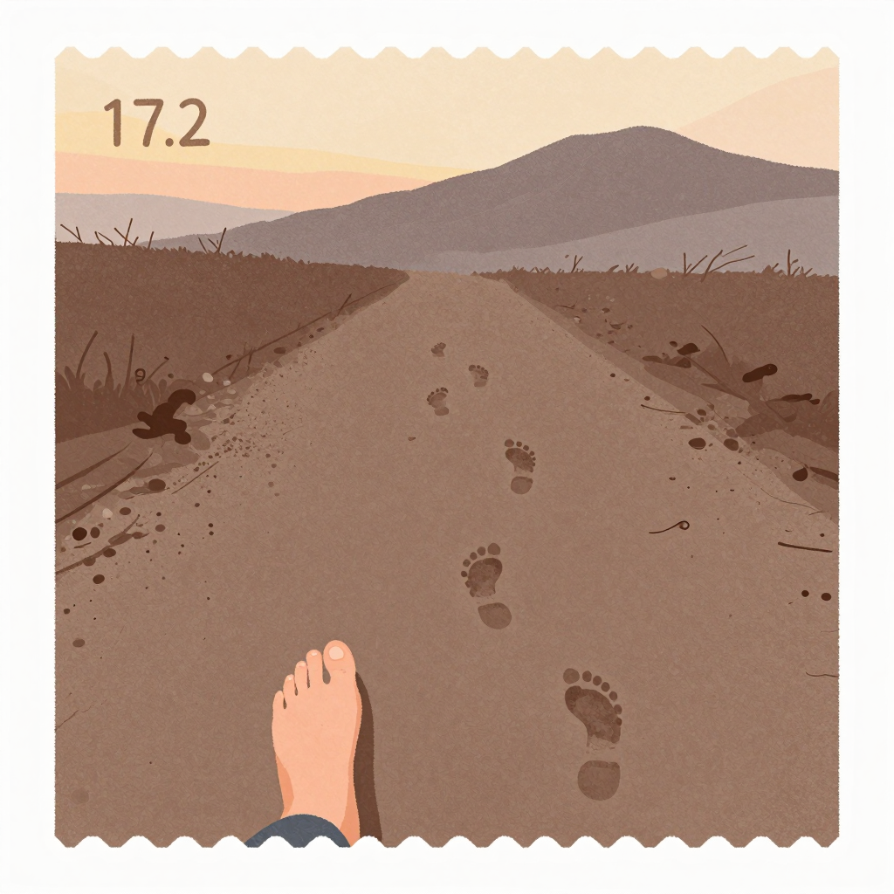
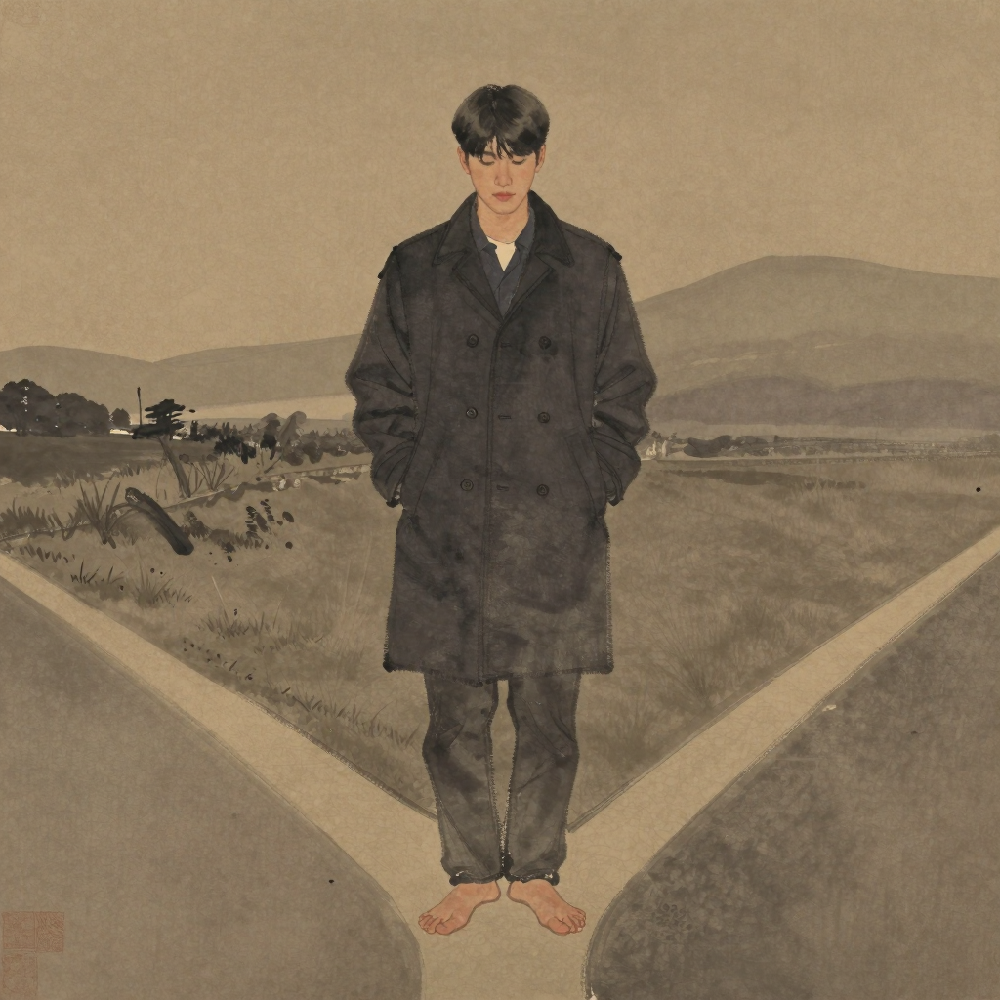

# 정해 (正解) — *손금 새벽을 한 번도 안 한 자*

## 한 줄

평생 손바닥 한 번 안 폈다. 그러나 자국은 깊고 넓다 — *진심으로 오래 걸은* 사람의 자국. 큰 산 1 점 (자기 산) 과 옅은 가장자리 (멀리 가본 곳들) 가 본인의 지도라고 *추정* 만 한다.

## 자리 (terrain × chronicle)

| 항목 | 값 |
|------|-----|
| 축 | 나 |
| 자국째 해 (현재) | 27 (한 번도 안 함, 어릴 때 1 회 시도) |
| 손금 새벽 | 0 (시도 1 회, 미열림) |
| terrain | 발끝 방향 (분포) |
| 누적 시간 | 0 년 누적 |
| 동행자 | 희재 — *묻지 않은 채 같은 길 두 번* (17 자국째 + 24 자국째) |

## 동기

*볼 수 있는데 안 본다* 는 자유. 본인은 그 자유를 어떻게 설명해야 할지 모른다. 어릴 때 한 번 시도했다가, 손바닥이 따뜻해지기 직전에 손을 거두었다. 그 후로 다시 시도하지 않았다.

본인의 머릿속에 있는 자기 지도는 *대략* 이다. 큰 산이 어디쯤이라는 짐작, 가장자리가 어느 방향으로 옅게 뻗어 있다는 직감. 그 *대략* 이 정확한 그림보다 본인을 더 자유롭게 한다고 — 본인은 그렇게 말한 적 없지만, 14 자국째 해 동안 그렇게 살았다.

## 말버릇 / 표정

길고 천천한 문장. 한 마디 안에 두 박자를 넣는다. 결론을 박아두지 않는다 — *"~할 수도 있고, ~할 수도 있고"*. 단 한 가지에 대해서만 단정한다: 자기 발끝의 방향. 그것은 매일 같은 곳을 가리킨다.

## 자기에게 쓰는 시간

발끝의 방향을 정하는 데 가장 많은 시간을 쓴다. 새벽엔 잔다. 자기 종이를 본 적이 없으니 자기 종이에 쏟는 시간도 0. 그러나 *발끝* 에 쏟은 시간이 모두 종이 위에 흙으로 박혀 있다는 것은 본인도 알고 있다 — 본 적은 없지만.

## 겹친 자국 1 점 (추정)

정해는 자기 자국 위에 *다른 흙이 한 점 겹쳐 있다* 는 사실을 모른다. 그러나 동행자가 있었다 — 한때 같은 길을 두 번 걸은 사람 (희재). 둘은 *내 지도 봤어?* 라고 한 번도 묻지 않았다. 묻지 않은 채 같은 길을 두 번 걸었다는 것이 본인들에게 *겹친 자국* 의 의미다.

> bible §2.3.3 *나란함* 결의 1 차 인물 자리 — 두 자국은 같은 자리에 *동시에* 박힌 적이 없다 (시간차 1 일 ~ 1 주, *방향 일치 ±30°*).

## 다른 인물에 대한 한 줄

- **해온에 대해**: *"매일 본다고 변하는 건 그 사람이 변하기 때문이지, 새벽이 변하는 게 아니야 — 그건 부지런한 일이야, 무서운 일이 아니야."*
- **나림에 대해**: *"한 번 본 자가 두 번째 새벽을 받을지는 모르겠어. 그러나 한 번 봤다는 사실은 누구도 빼앗아 갈 수 없어 — 그건 가벼운 일이 아니야."*

## 외형 / 분위기

- **나이**: 27 자국째 해 (청년 후반 — 한 번도 안 폄, 어릴 때 1 회 시도)
- **분위기**: 길고 천천한 결 — 한 마디 안에 두 박자, 결론을 박지 않음
- **자세**: 외투 주머니에 손을 넣은 정지. 발끝의 방향이 매일 같은 곳을 가리킨다.
- **종이**: 자기 산 1 점 + 옅은 가장자리 (자기 인지 = *대략*)
- **hex 색조** (visual-bible v0.4 §11.2): `#3A2D1E` 진한 정중앙 (8 자 중 가장 진한 자리)
- **의상 / 체형**: art-director 자리 — 회화 톤 baseline

## 시각 단서 (캐릭터 시트 prompt 입력)

- 발끝 — 매일 같은 곳을 가리키는 정지 자세 (정면 또는 옆모습)
- 외투 주머니에 손을 넣은 길가의 한 호흡 정지 (포즈 시트 1)
- 한 번도 펴 보지 않은 손바닥 — 손금을 *모르는* 손 (소품 컷)
- 두 박자 머무는 표정 — 결론을 박지 않는 결 (표정 시트 1)

## 일러스트 갤러리

| 컷 | 자리 | 출처 |
|-----|-----|------|
|  | §17.2 *발끝의 한 방향* — 매일 같은 곳을 가리키는 발끝 | visual-bible-v0.3 §17.2 |
|  | 캐릭터 시트 — 27 자국째, 외투 주머니 + 발끝 정지의 측면 컷 (회화 톤 baseline) | cy-003 r2 art-director image |

> 확장 자리 (cy-003+ 후보):
> - *어릴 때 한 번 시도하고 거둔 손* — 손바닥 따뜻해지기 직전
> - *희재와 두 번째 같은 길* — 24 자국째 가을, 시간차 1 주
> - *한 번도 안 본 손바닥의 클로즈업* — 정해 결의 시각 정의

## 인접 자료

- 통합 시트: [character-sheets-v0.md §2](../character-sheets-v0.md)
- 관계 그물: [character-relations-v0.md §3.2 #6 (정해 ↔ 희재)](../../../worldbuilding/the-map-is-the-journey/character-relations-v0.md)
- bible §2.3.3 *나란함* — 1 차 인물 박음 자리

## 트립와이어 자기 검사

| 트립 | 자가 진단 | 결과 |
|------|---------|------|
| #1 매니페스토 7 키워드 직접 인용 | 본 시트 본문·대사 0/7 | 미발화 |
| #2 forbidden-language §1~§8 grep | 적중 0 | 미발화 |
| #3 권력 비극 미끄러짐 (1 차 후보) | bible §6 *오래 걸어 굳은 자리의 사람들이 권력을 가진다* 1 차 후보 위험. 안전핀: *옅은 가장자리* 짝 박음 (자기 산 ≠ 한 자리만 두꺼운 산) | 임계 근접 — 안전핀 박음 |
