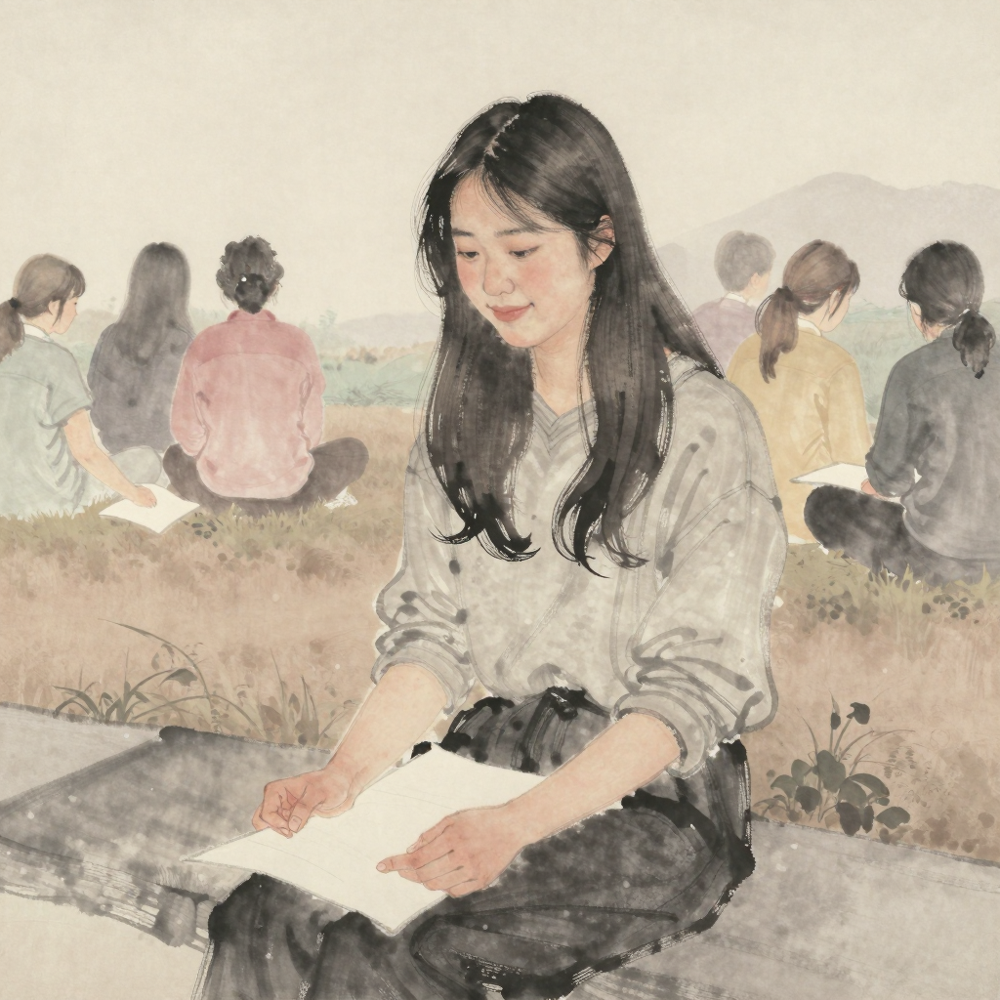

# 나림 (那林) — *한 번 보고 도망친 자*

## 한 줄

8 자국째 해 의 어느 새벽, 한 번 손바닥을 폈다. 자기 지도가 *상상보다 훨씬 작았다*. 그 후로 6 자국째 해 동안 다시 펴지 않았다.

## 자리 (terrain × chronicle)

| 항목 | 값 |
|------|-----|
| 축 | 나 |
| 자국째 해 (현재) | 26 (8 자국째 한 번 + 6 년 멈춤) |
| 손금 새벽 | 한 번 본 새벽 + 12 색조 박물관 |
| terrain | 12 색조 박물관 (쉼의 자리) |
| 누적 시간 | 1 회 + 6 년 멈춤 |
| 1 차 chronicle 사건 | 사건 1 *처음 백지를 받은 새벽* + 사건 2 *흙이 굳어지는 첫 자국* (1 ~ 8 자국째) |

## 동기

작은 것이 무서운 게 아니라 *이미 본 사실* 이 무섭다. 그 작음을 본 새벽 이후로 본인은 *그 새벽 이전의 자기* 로 돌아갈 수 없다는 것을 안다.

본인은 작은 지도가 *충분하지 않다* 고 생각한다. 그러나 매일 *충분하지 않은 지도를 가진 자기* 와 만나는 일을 견딜 자신이 없다. 그래서 보지 않는다. 보지 않은 채 *작다는 사실* 만 늘 본다 — 그것이 본인의 잔여.

다만, 본인은 다른 사람의 자국을 읽는 데 시간을 많이 쓴다. 자기 종이는 작지만, 다른 사람의 자국이 자기 종이 위에 *겹쳐* 있을 때 — 그 한 점만큼은 자기 것이라고 느낀다. 자기 지도가 작아도 *겹친 자리* 는 두 사람의 것이고, 그 자리에 본인이 있다.

## 말버릇 / 표정

망설임. 두 가지 가능성을 한 문장 안에 넣는다 — *"~인지, ~인지"*. 한쪽으로 박지 않는다.

웃을 때 입꼬리만 살짝 올라간다 — 어깨도 눈도 같이 움직이지 않는다. 본인의 *기쁨* 은 늘 *반쯤 의심* 과 함께 와서, 몸이 한 번에 다 웃는 일이 드물다.

## 자기에게 쓰는 시간

다른 사람의 자국을 본다. 자기 종이는 가능한 안 본다. 새벽엔 손바닥 안 편다 — 지난 6 자국째 해 동안 한 번도. 단 *쉼의 자리* 에 자주 머문다. 본인의 *쉼의 자리* 는 *남의 자국이 가장 많이 겹친 자리* 다. 자기 자국은 거의 없고, 남의 색조 흙들이 한 자리에 모여 있다.

## 겹친 자국 1 점

본인의 *쉼의 자리* 가 곧 본인의 *겹친 자국 박물관*. 12 명의 색조가 한 자리에 모여 있다. 본인은 그 12 명을 모두 본 적 없다. 그러나 그들이 자기 지도 위를 지나갔다는 것을 안다 — 그것이 본인을 *작은 자기 지도* 로부터 살리는 한 점.

## 다른 인물에 대한 한 줄

- **해온에 대해**: *"매일 무서워하지 않는 게 신기한지, 무섭다는 걸 잊은 건지 — 그 둘 다 인 것 같기도 해."*
- **정해에 대해**: *"안 본 그는 나보다 자유로운지, 자유로운 척 하는지 — 본 적 없으니 그도 모를 거야."*

## 외형 / 분위기

- **나이**: 26 자국째 해 (청년 — 8 자국째 한 번 본 후 6 년 멈춤)
- **분위기**: 망설임 — *반쯤 의심* 의 결. 두 가능성을 한 문장에 넣음
- **자세**: 입꼬리만 살짝 올라가는 웃음 (어깨·눈은 정지). 몸이 한 번에 다 웃는 일이 드물다.
- **종이**: 12 색조 박물관 (쉼의 자리) — 자기 자국 거의 0, 남의 색조 12 가지 한 자리에 모임
- **hex 색조** (visual-bible v0.4 §11.2): `#7A6447 ~ #8B7355` 옅은
- **의상 / 체형**: art-director 자리 — 회화 톤 baseline

## 시각 단서 (캐릭터 시트 prompt 입력)

- 12 색조 박물관 자리에 머무는 정면 컷 (자기 종이가 비어 있고 남의 색조만 옅게)
- 입꼬리만 살짝 올라가는 *반쯤 의심* 의 웃음 (표정 시트 1)
- 8 자국째 한 새벽의 손바닥 — *상상보다 작은* 자기 지도 (포즈 시트 1)
- 다른 사람의 자국을 옅게 들여다보는 옆모습 (포즈 시트 2)

## 일러스트 갤러리

| 컷 | 자리 | 출처 |
|-----|-----|------|
|  | 캐릭터 시트 — 26 자국째, 12 색조 박물관 자리의 반쯤 의심의 웃음 (회화 톤 baseline) | cy-003 r2 art-director image |

> 확장 자리 (cy-003+ 후보):
> - *12 색조 박물관 자리* — 본인 정체성의 1 차 시각화
> - *8 자국째 한 새벽 — 한 번 본 새벽 직전·직후*
> - *입꼬리만 올라간 웃음의 클로즈업*
> - *두 번째 새벽 후보 컷 — 옆에 앉을 자 미정 (유경의 거울 결)*

## 인접 자료

- 통합 시트: [character-sheets-v0.md §3](../character-sheets-v0.md)
- 관계 그물: [character-relations-v0.md §3.1 #2 (유경 ↔ 나림 — *한 번 본 새벽 뒤의 새벽* 결)](../../../worldbuilding/the-map-is-the-journey/character-relations-v0.md)
- 두 번째 새벽 후보 = 유경의 *35 자국째 다시 펴는 새벽* 1 차 거울

## 트립와이어 자기 검사

| 트립 | 자가 진단 | 결과 |
|------|---------|------|
| #1 매니페스토 7 키워드 직접 인용 | 본 시트 본문·대사 0/7 | 미발화 |
| #2 forbidden-language §1~§8 grep | 적중 0 | 미발화 |
| #3 *작은 지도 = 비극* 결의 미끄러짐 | 본인은 *작음 = 비극* 결로 간주하지 않는다 — *겹친 자리* 가 *작은 자기 지도* 를 살리는 결로 박힘 (안전핀) | 미발화 |
