# Isometric View Assets

> **톤앤매너:** 풍부한 쥬얼톤 (Rich Jewel Tones) — 깊은 녹색, 회청색, 황금 강조색  
> **스타일 기준:** Classic Isometric RPG (디아블로, Bastion, 스타크래프트 계열)  
> **캐릭터 설정:** 초록 튜닉, 갈색 부츠, 검 — 45° 아이소메트릭 앵글

---

## Set 1 — 🏙️ 마을 (Town)
> 팔레트: rich earthy jewel tones deep green gray gold

Prompt template: `isometric 2D pixel art, classic isometric RPG style, 16-bit retro pixel art, isometric 45 degree perspective {asset type}, {subject details}, rich earthy jewel tones deep green gray gold, clean isometric forms, 512x512`

| 에셋 | 미리보기 |
|------|---------|
| 💎 타일 | 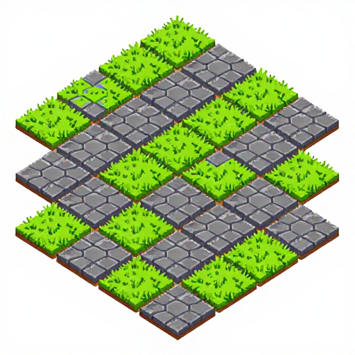 |
| 🧙 캐릭터 | 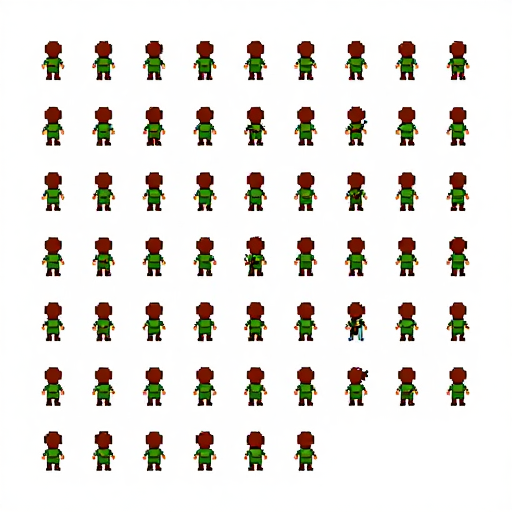 |
| 🌲 오브젝트 | 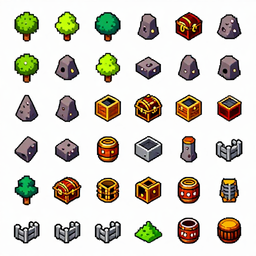 |
| 🖼️ 대화창 초상화 |  |
| 🏙️ 배경 | 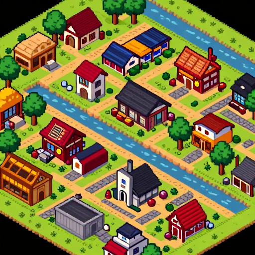 |

Prompts:

- 타일: `isometric 2D pixel art, classic isometric RPG style, 16-bit retro pixel art, isometric 45 degree perspective tileset, grass and stone floor terrain tile, seamlessly tileable isometric diamond shape tile, rich earthy jewel tones deep green gray gold, clean tile edges, 512x512`
- 캐릭터: `isometric 2D pixel art, classic isometric RPG style, 16-bit retro pixel art, isometric 45 degree perspective character sprite sheet, young adventurer green tunic brown boots sword, multiple directions 45 degree angle isometric view, rich earthy jewel tones deep green gray gold, 512x512`
- 오브젝트: `isometric 2D pixel art, classic isometric RPG style, 16-bit retro pixel art, isometric 45 degree perspective game props and objects sheet, trees rocks treasure chests barrels well fence stone wall isometric view, rich earthy jewel tones deep green gray gold, neat sprite collection sheet, 512x512`
- 대화창 초상화: `2D pixel art character dialogue portrait, classic isometric RPG style, young adventurer green tunic short brown hair bust portrait, calm wise expression detailed, rich earthy jewel tones, detailed 16-bit pixel shading, 512x512`
- 배경: `isometric 2D pixel art, classic isometric RPG style, 16-bit retro pixel art, isometric 45 degree perspective game background scene, isometric view of small town buildings trees stone paths river, rich earthy jewel tones deep green gray gold, detailed isometric map scene, 512x512`

---

## Set 2 — ☠️ 마법 던전 (Magic Dungeon)
> 팔레트: dark stone gray with magic rune blue glow tones

| 에셋 | 미리보기 |
|------|---------|
| 💎 타일 | 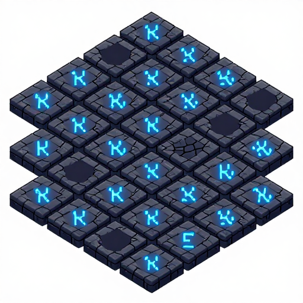 |
| 🧙 캐릭터 | 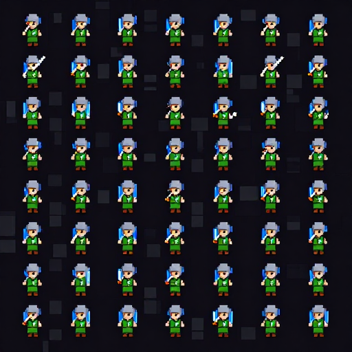 |
| 🔮 오브젝트 | 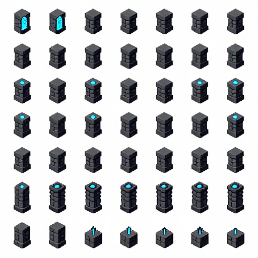 |
| 🖼️ 대화창 초상화 | 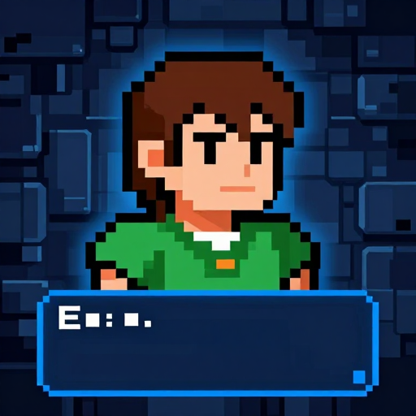 |
| 🏰 배경 | 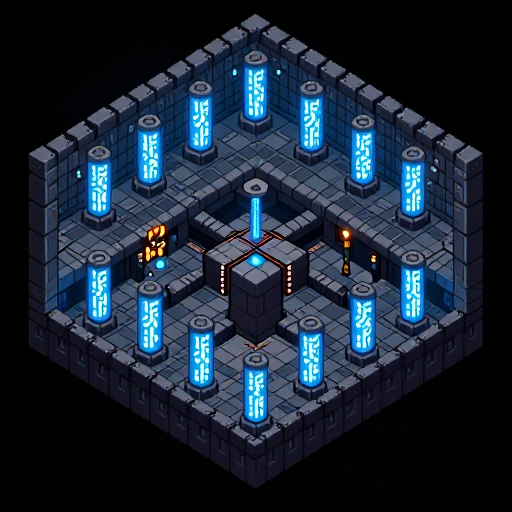 |

Prompts:

- 타일: `isometric 2D pixel art, classic isometric RPG style, 16-bit retro pixel art, isometric 45 degree perspective tileset, magic dungeon floor terrain tile, seamlessly tileable isometric diamond shape tile, dark stone gray with magic rune blue glow tones, clean tile edges, 512x512`
- 캐릭터: `isometric 2D pixel art, classic isometric RPG style, 16-bit retro pixel art, isometric 45 degree perspective character sprite sheet, young adventurer green tunic brown boots sword, multiple directions 45 degree angle isometric view, dark stone gray with magic rune blue glow tones, 512x512`
- 오브젝트: `isometric 2D pixel art, classic isometric RPG style, 16-bit retro pixel art, isometric 45 degree perspective game props and objects sheet, runes crystals altars treasure chests pillars isometric view, dark stone gray with magic rune blue glow tones, neat sprite collection sheet, 512x512`
- 대화창 초상화: `2D pixel art character dialogue portrait, classic isometric RPG style, young adventurer green tunic short brown hair bust portrait, focused magical expression, dark stone gray blue glow tones, detailed 16-bit pixel shading, 512x512`
- 배경: `isometric 2D pixel art, classic isometric RPG style, 16-bit retro pixel art, isometric 45 degree perspective game background scene, isometric view of magic dungeon halls with rune circles and glowing crystals, dark stone gray with magic rune blue glow tones, detailed isometric map scene, 512x512`

---

## Set 3 — 🍂 가을 숲 (Autumn Forest)
> 팔레트: warm autumn orange red golden brown tones

| 에셋 | 미리보기 |
|------|---------|
| 💎 타일 | 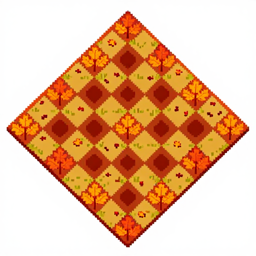 |
| 🧙 캐릭터 | 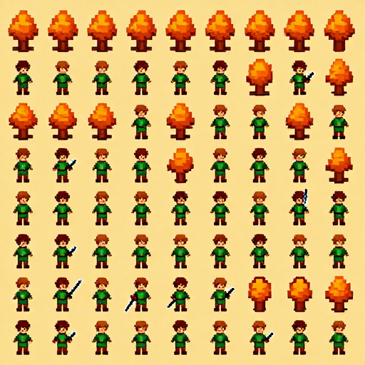 |
| 🍄 오브젝트 | 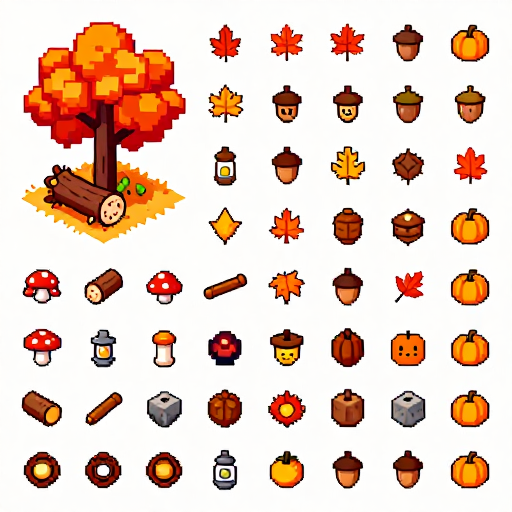 |
| 🖼️ 대화창 초상화 | 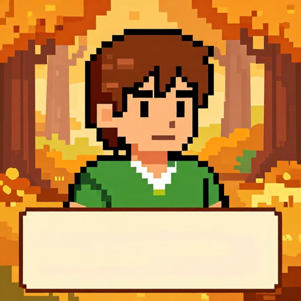 |
| 🍂 배경 | 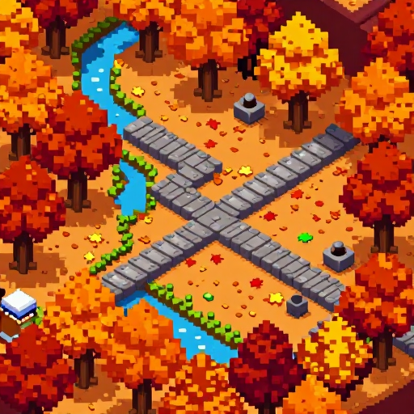 |

Prompts:

- 타일: `isometric 2D pixel art, classic isometric RPG style, 16-bit retro pixel art, isometric 45 degree perspective tileset, autumn forest ground terrain tile, seamlessly tileable isometric diamond shape tile, warm autumn orange red golden brown tones, clean tile edges, 512x512`
- 캐릭터: `isometric 2D pixel art, classic isometric RPG style, 16-bit retro pixel art, isometric 45 degree perspective character sprite sheet, young adventurer green tunic brown boots sword, multiple directions 45 degree angle isometric view, warm autumn orange red golden brown tones, 512x512`
- 오브젝트: `isometric 2D pixel art, classic isometric RPG style, 16-bit retro pixel art, isometric 45 degree perspective game props and objects sheet, mushrooms logs rocks treasure chests autumn trees isometric view, warm autumn orange red golden brown tones, neat sprite collection sheet, 512x512`
- 대화창 초상화: `2D pixel art character dialogue portrait, classic isometric RPG style, young adventurer green tunic short brown hair bust portrait, warm reflective expression, warm autumn orange red golden brown tones, detailed 16-bit pixel shading, 512x512`
- 배경: `isometric 2D pixel art, classic isometric RPG style, 16-bit retro pixel art, isometric 45 degree perspective game background scene, isometric view of autumn forest paths with orange trees and scattered leaves, warm autumn orange red golden brown tones, detailed isometric map scene, 512x512`

← [목차로 돌아가기](../../README.md)
---

## Metadata Prompts

| Image | Positive prompt | Seed | Model |
|---|---|---|---|
| `2f1aa3c6-d8f1-49f0-8b40-4bccb24a7cf5.png` | isometric 2D pixel art tileset, classic isometric RPG style, grass and stone floor tile isometric 45 degree angle, seamlessly tileable isometric diamond shape, rich earthy green gray jewel tones, 16-bit retro pixel art, isometric perspective, multiple tile variants, 512x512 | `1345373288` | `z_image_turbo_bf16.safetensors` |
| `0809c3e9-26d0-4a9a-be8e-a5739862b0b5.png` | isometric 2D pixel art character sprite sheet, classic isometric RPG style, young adventurer green tunic brown boots sword isometric view, small detailed character 45 degree angle multiple directions, rich warm earthy jewel tones, 16-bit retro pixel art, isometric perspective, 512x512 | `2844817554` | `z_image_turbo_bf16.safetensors` |
| `c27de129-2f8b-4f8a-a559-1450ebb37745.png` | isometric 2D pixel art game props objects sheet, classic isometric RPG style, trees rocks treasure chests barrels well fence stone wall isometric view, rich earthy jewel tones, 16-bit retro pixel art, isometric 45 degree perspective, neat sprite collection, 512x512 | `3814652203` | `z_image_turbo_bf16.safetensors` |
| `d7332b17-cb38-44e4-8196-476765d929df.png` | 2D pixel art character dialogue portrait, classic isometric RPG style, young adventurer hero bust portrait, green tunic detailed short brown hair calm wise expression, rich jewel earthy tones, detailed 16-bit pixel shading, game dialogue portrait illustration, 512x512 | `122802421` | `z_image_turbo_bf16.safetensors` |
| `c77957d5-3b07-4498-9601-b73b2a973dd6.png` | isometric 2D pixel art game background scene, classic isometric RPG style, isometric view of small town buildings trees stone paths river, rich earthy jewel tones, 16-bit retro pixel art, detailed isometric map scene, 512x512 | `3945669236` | `z_image_turbo_bf16.safetensors` |
| `7dc16590-c9ed-4896-8453-fa506b69d6b2.png` | isometric 2D pixel art, classic isometric RPG style, 16-bit retro pixel art, isometric 45 degree perspective tileset, dungeon stone floor tile with cracks and glowing rune markings isometric diamond shape, seamlessly tileable, dark stone gray with magic rune blue glow tones, multiple tile variants, 512x512 | `1695528858` | `z_image_turbo_bf16.safetensors` |
| `27c02674-8eb9-4d6b-8a1f-5a1d3bf01001.png` | isometric 2D pixel art, classic isometric RPG style, 16-bit retro pixel art, isometric 45 degree perspective character sprite sheet, young adventurer green tunic brown boots sword in dungeon, multiple directions 45 degree angle isometric view, dark stone gray magic blue glow tones, 512x512 | `2480183701` | `z_image_turbo_bf16.safetensors` |
| `e0f5cd33-9bce-41cc-818b-e68aa2f5ea73.png` | isometric 2D pixel art, classic isometric RPG style, 16-bit retro pixel art, isometric 45 degree perspective game props objects sheet, dungeon pillar trap spike magic altar rune stone coffin torch wall isometric view, dark stone gray magic blue glow tones, neat sprite collection, 512x512 | `3328194626` | `z_image_turbo_bf16.safetensors` |
| `a8e81f5e-dd25-4273-be33-fed74148f97b.png` | 2D pixel art character dialogue portrait, classic isometric RPG style, young adventurer green tunic short brown hair bust portrait, alert cautious expression in dungeon, dark cool stone blue magic glow tones, detailed 16-bit pixel shading, game dialogue portrait illustration, 512x512 | `813650885` | `z_image_turbo_bf16.safetensors` |
| `2358bdc5-b4bb-41b5-9a2c-ec799dcda6d8.png` | isometric 2D pixel art, classic isometric RPG style, 16-bit retro pixel art, isometric 45 degree perspective game background scene, isometric view of dark dungeon room with glowing rune pillars and corridors, dark stone gray magic blue glow tones, detailed isometric dungeon map scene, 512x512 | `1101963227` | `z_image_turbo_bf16.safetensors` |
| `2a6fcf51-f9af-4a84-9e76-bc2d3757503d.png` | isometric 2D pixel art, classic isometric RPG style, 16-bit retro pixel art, isometric 45 degree perspective tileset, autumn forest floor tile with fallen leaves and grass isometric diamond shape, seamlessly tileable, warm autumn orange red golden brown tones, multiple tile variants, 512x512 | `2215684163` | `z_image_turbo_bf16.safetensors` |
| `2079e1a6-e5c1-43df-8b86-9f15ff9fa3f4.png` | isometric 2D pixel art, classic isometric RPG style, 16-bit retro pixel art, isometric 45 degree perspective character sprite sheet, young adventurer green tunic brown boots sword in autumn forest, multiple directions 45 degree angle isometric view, warm autumn orange golden brown tones, 512x512 | `2935662811` | `z_image_turbo_bf16.safetensors` |
| `682ecd20-951e-480b-8b65-8119afbcbf84.png` | isometric 2D pixel art, classic isometric RPG style, 16-bit retro pixel art, isometric 45 degree perspective game props objects sheet, autumn tree with orange leaves mushroom fallen log stone lantern acorn pumpkin isometric view, warm autumn orange red golden tones, neat sprite collection, 512x512 | `2006860247` | `z_image_turbo_bf16.safetensors` |
| `f91f898b-0473-4d77-b43f-8687d9bb6bc5.png` | 2D pixel art character dialogue portrait, classic isometric RPG style, young adventurer green tunic short brown hair bust portrait, peaceful serene expression in autumn forest, warm autumn orange golden tones, detailed 16-bit pixel shading, game dialogue portrait illustration, 512x512 | `16680356` | `z_image_turbo_bf16.safetensors` |
| `c3547449-14a5-43e5-9cef-4f3b6b9fa8ec.png` | isometric 2D pixel art, classic isometric RPG style, 16-bit retro pixel art, isometric 45 degree perspective game background scene, isometric view of autumn forest with orange red trees stone path fallen leaves river, warm autumn orange red golden tones, detailed isometric autumn map scene, 512x512 | `2490672327` | `z_image_turbo_bf16.safetensors` |
