# Top-Down View Assets

> **톤앤매너:** 따뜻한 어스톤 (Warm Earthy Tones) — 녹색, 갈색, 황토색  
> **스타일 기준:** Classic JRPG Overhead (파이널판타지, 젤다 ALttP 계열)  
> **캐릭터 설정:** 초록 튜닉, 갈색 부츠, 짧은 갈색 머리 어드벤처러

---

## Set 1 — 🌳 숲 / 마을 (Forest & Village)
> 팔레트: warm green brown earthy tones

Prompt template: `top-down 2D pixel art, classic JRPG overhead style, 16-bit retro pixel art, overhead top-down flat view {asset type}, {subject details}, warm earthy green brown tones, clean pixel edges, 512x512`

| 에셋 | 미리보기 |
|------|---------|
| 🟩 타일 | 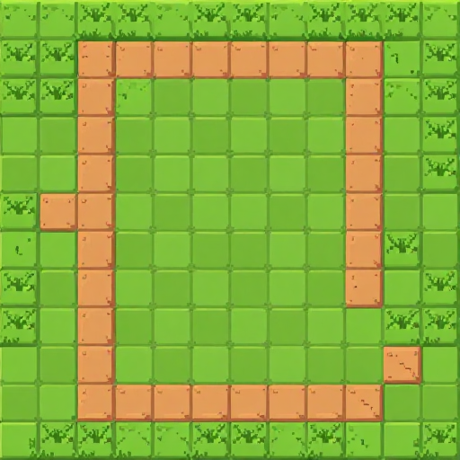 |
| 🚶 캐릭터 | 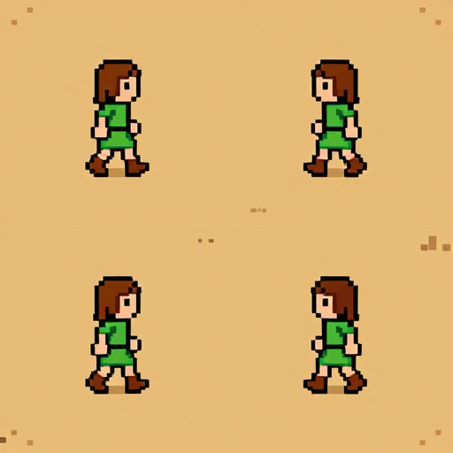 |
| 🌳 오브젝트 | 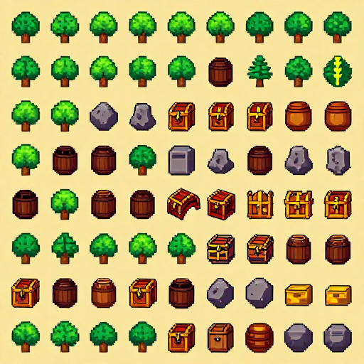 |
| 🖼️ 대화창 초상화 | 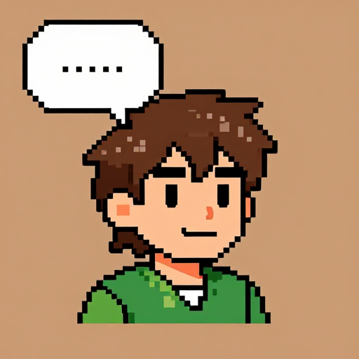 |
| 🌄 배경 | 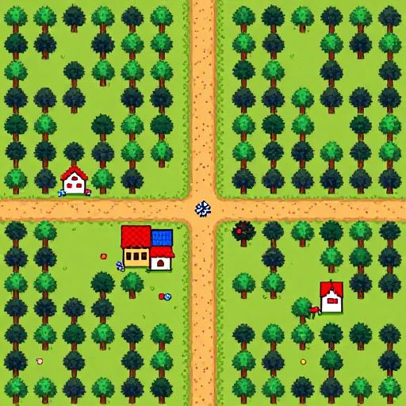 |

Prompts:

- 타일: `top-down 2D pixel art, classic JRPG overhead style, 16-bit retro pixel art, overhead top-down flat view tileset, grass and dirt path terrain tile, seamlessly tileable square tile, warm earthy green brown tones, clean tile edges, multiple tile variants, 512x512`
- 캐릭터: `top-down 2D pixel art, classic JRPG overhead style, 16-bit retro pixel art, overhead top-down flat view character sprite sheet, young adventurer green tunic brown boots short brown hair, walking facing four directions north south east west, warm earthy green brown tones, 512x512`
- 오브젝트: `top-down 2D pixel art, classic JRPG overhead style, 16-bit retro pixel art, overhead top-down flat view game props and objects sheet, trees bushes rocks barrels treasure chest crates viewed overhead, warm earthy green brown tones, neat sprite collection sheet, 512x512`
- 대화창 초상화: `2D pixel art character dialogue portrait, classic JRPG style, young adventurer green tunic short brown hair bust portrait, friendly warm expression, warm earthy tones, detailed 16-bit pixel shading, game dialogue portrait illustration, 512x512`
- 배경: `top-down 2D pixel art, classic JRPG overhead style, 16-bit retro pixel art, overhead top-down flat view game background scene, overhead view of green forest path leading to small village, warm earthy green brown tones, detailed top-down map scene, 512x512`

---

## Set 2 — 🏰 던전 (Dungeon)
> 팔레트: dark stone gray blue glow tones

| 에셋 | 미리보기 |
|------|---------|
| 🟩 타일 | 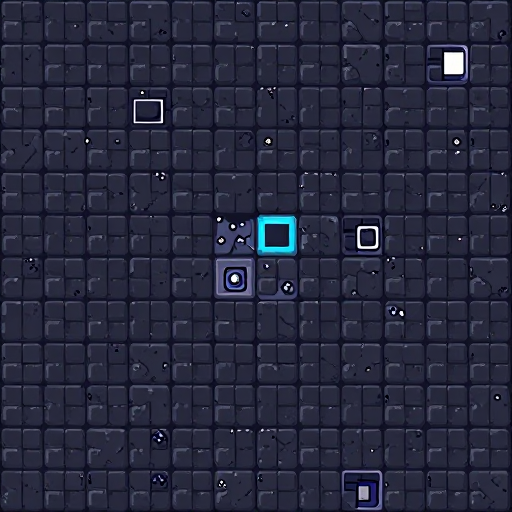 |
| 🚶 캐릭터 | 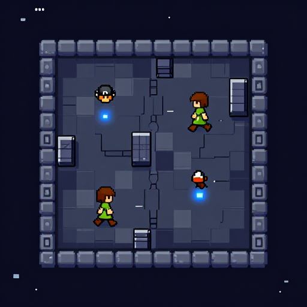 |
| 🕯️ 오브젝트 | 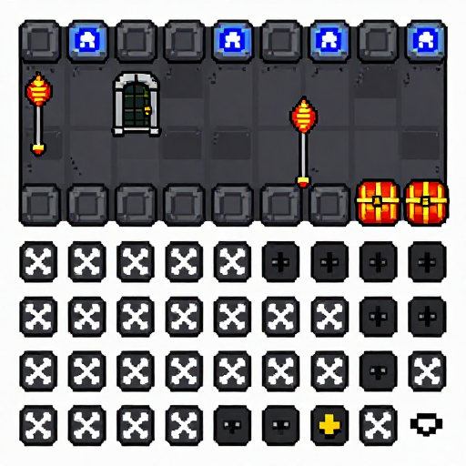 |
| 🖼️ 대화창 초상화 | 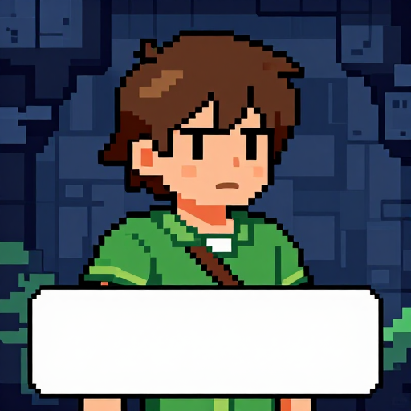 |
| 🌄 배경 | 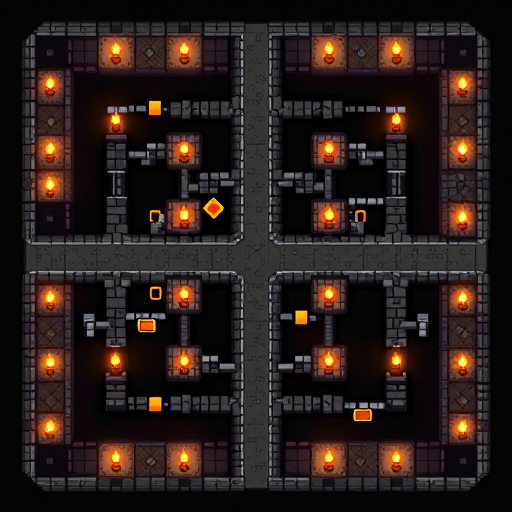 |

Prompts:

- 타일: `top-down 2D pixel art, classic JRPG overhead style, 16-bit retro pixel art, overhead top-down flat view tileset, stone dungeon floor terrain tile, seamlessly tileable square tile, dark stone gray blue glow tones, clean tile edges, multiple tile variants, 512x512`
- 캐릭터: `top-down 2D pixel art, classic JRPG overhead style, 16-bit retro pixel art, overhead top-down flat view character sprite sheet, young adventurer green tunic brown boots short brown hair, walking facing four directions north south east west, dark stone gray blue glow tones, 512x512`
- 오브젝트: `top-down 2D pixel art, classic JRPG overhead style, 16-bit retro pixel art, overhead top-down flat view game props and objects sheet, torches pillars treasure chest bones dungeon props viewed overhead, dark stone gray blue glow tones, neat sprite collection sheet, 512x512`
- 대화창 초상화: `2D pixel art character dialogue portrait, classic JRPG style, young adventurer green tunic short brown hair bust portrait, serious dungeon-ready expression, dark gray blue tones, detailed 16-bit pixel shading, game dialogue portrait illustration, 512x512`
- 배경: `top-down 2D pixel art, classic JRPG overhead style, 16-bit retro pixel art, overhead top-down flat view game background scene, overhead view of dark dungeon corridors with blue glowing accents, dark stone gray blue glow tones, detailed top-down map scene, 512x512`

---

## Set 3 — ❄️ 설원 (Snow & Winter)
> 팔레트: cool white blue silver tones

| 에셋 | 미리보기 |
|------|---------|
| 🟩 타일 | 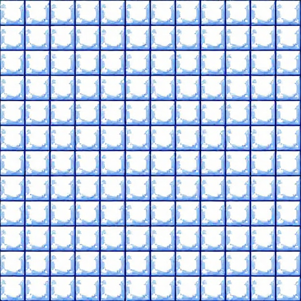 |
| 🚶 캐릭터 | 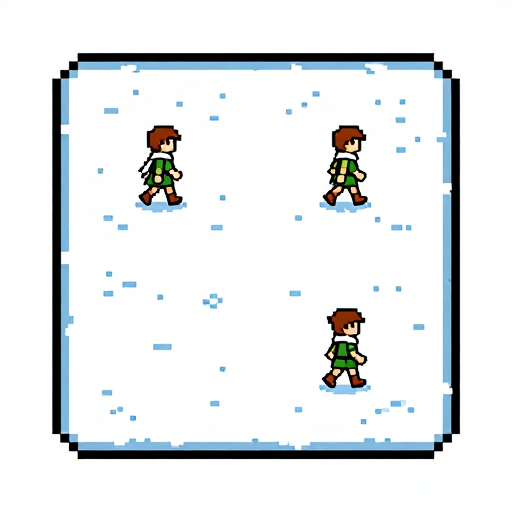 |
| ❄️ 오브젝트 | 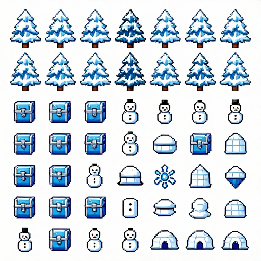 |
| 🖼️ 대화창 초상화 | 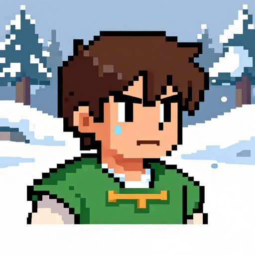 |
| 🌄 배경 | 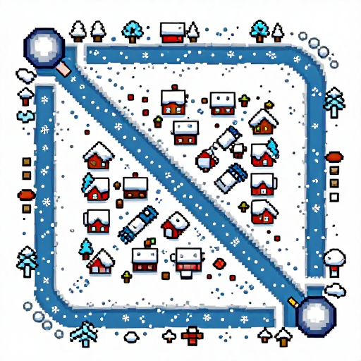 |

Prompts:

- 타일: `top-down 2D pixel art, classic JRPG overhead style, 16-bit retro pixel art, overhead top-down flat view tileset, snowy ground and icy path terrain tile, seamlessly tileable square tile, cool white blue silver tones, clean tile edges, multiple tile variants, 512x512`
- 캐릭터: `top-down 2D pixel art, classic JRPG overhead style, 16-bit retro pixel art, overhead top-down flat view character sprite sheet, young adventurer green tunic brown boots short brown hair with winter cloak, walking facing four directions north south east west, cool white blue silver tones, 512x512`
- 오브젝트: `top-down 2D pixel art, classic JRPG overhead style, 16-bit retro pixel art, overhead top-down flat view game props and objects sheet, snowy trees ice rocks crates frozen props viewed overhead, cool white blue silver tones, neat sprite collection sheet, 512x512`
- 대화창 초상화: `2D pixel art character dialogue portrait, classic JRPG style, young adventurer green tunic short brown hair bust portrait, calm winter expression, cool white blue tones, detailed 16-bit pixel shading, game dialogue portrait illustration, 512x512`
- 배경: `top-down 2D pixel art, classic JRPG overhead style, 16-bit retro pixel art, overhead top-down flat view game background scene, overhead view of snowy forest path and frozen village edges, cool white blue silver tones, detailed top-down map scene, 512x512`

← [목차로 돌아가기](../../README.md)
---

## Metadata Prompts

| Image | Positive prompt | Seed | Model |
|---|---|---|---|
| `f4338823-ab59-42b1-a551-70acbb46e2ad.png` | top-down 2D pixel art game tileset, classic JRPG overhead style, grass and dirt path terrain tiles, seamlessly tileable square tile, warm green brown earthy tones, 16-bit retro pixel art, overhead top-down flat view, clean tile edges, multiple tile variants, 512x512 | `3969491981` | `z_image_turbo_bf16.safetensors` |
| `a4a44159-3db6-40c0-9688-b684925825a0.png` | top-down 2D pixel art character sprite sheet, classic JRPG overhead style, young adventurer green tunic brown boots short brown hair, walking facing four directions north south east west, warm earthy tones, 16-bit retro pixel art, overhead top-down view, small cute sprite, 512x512 | `401789204` | `z_image_turbo_bf16.safetensors` |
| `c416a92b-4dcc-403d-b0eb-3ffa144e574c.png` | top-down 2D pixel art game props and objects sheet, classic JRPG overhead style, trees bushes rocks barrels treasure chest crates viewed overhead, warm earthy green brown tones, 16-bit retro pixel art, overhead top-down flat view, sprite sheet multiple objects arranged neatly, 512x512 | `1590420180` | `z_image_turbo_bf16.safetensors` |
| `63126a30-5556-4eb9-a94f-cd6424674702.png` | 2D pixel art character dialogue portrait, classic JRPG style, young adventurer hero bust portrait, green tunic short brown hair expressive warm face, warm earthy tones, detailed 16-bit pixel shading, game dialogue box portrait illustration, friendly expression, 512x512 | `2620296115` | `z_image_turbo_bf16.safetensors` |
| `31094d9f-07af-43dd-9148-50a924edabe9.png` | top-down 2D pixel art game background scene, classic JRPG overhead style, overhead view of green forest path leading to small cozy village, warm green earthy tones, 16-bit retro pixel art, detailed top-down map scene, trees roads houses, 512x512 | `1504097023` | `z_image_turbo_bf16.safetensors` |
| `582331b0-b943-4c7a-a86c-97c3f629a89d.png` | top-down 2D pixel art, classic JRPG overhead style, 16-bit retro pixel art, overhead top-down flat view tileset, dungeon stone floor and dark corridor terrain tile, seamlessly tileable square tile, dark stone gray blue glow tones, clean tile edges, multiple tile variants, 512x512 | `2198663316` | `z_image_turbo_bf16.safetensors` |
| `577e0d18-41e7-434d-9a13-3552b70afd70.png` | top-down 2D pixel art, classic JRPG overhead style, 16-bit retro pixel art, overhead top-down flat view character sprite sheet, young adventurer green tunic brown boots short brown hair, walking facing four directions in dungeon, dark stone gray blue glow tones, small cute sprite, 512x512 | `3483551987` | `z_image_turbo_bf16.safetensors` |
| `62e8f899-976a-465c-97b2-5aa9b24caa08.png` | top-down 2D pixel art, classic JRPG overhead style, 16-bit retro pixel art, overhead top-down flat view game props objects sheet, dungeon torch pillar skeleton bones treasure chest iron door viewed overhead, dark stone gray blue glow tones, neat sprite collection, 512x512 | `2531934806` | `z_image_turbo_bf16.safetensors` |
| `f1ae7ffb-1609-4bc3-8309-60db70b06691.png` | 2D pixel art character dialogue portrait, classic JRPG style, young adventurer green tunic short brown hair bust portrait, worried nervous expression in dungeon, dark cool blue stone tones, detailed 16-bit pixel shading, game dialogue portrait illustration, 512x512 | `3883178413` | `z_image_turbo_bf16.safetensors` |
| `224c2501-135b-4a5e-94b2-f70b5af55ca4.png` | top-down 2D pixel art, classic JRPG overhead style, 16-bit retro pixel art, overhead top-down flat view game background scene, overhead view of dark dungeon corridors and rooms with torchlight glow, dark stone gray with warm torch orange glow accent, detailed top-down dungeon map scene, 512x512 | `3715938694` | `z_image_turbo_bf16.safetensors` |
| `98e8f61c-729b-4e7f-a45b-e1048d618f88.png` | top-down 2D pixel art, classic JRPG overhead style, 16-bit retro pixel art, overhead top-down flat view tileset, snow and ice terrain tile with frozen ground, seamlessly tileable square tile, cool white blue silver tones, clean tile edges, multiple tile variants, 512x512 | `1179336714` | `z_image_turbo_bf16.safetensors` |
| `70c39cde-31aa-4bb3-8574-727e7c539f4c.png` | top-down 2D pixel art, classic JRPG overhead style, 16-bit retro pixel art, overhead top-down flat view character sprite sheet, young adventurer green tunic brown boots short brown hair with winter scarf, walking facing four directions in snow, cool white blue silver tones, small cute sprite, 512x512 | `33231443` | `z_image_turbo_bf16.safetensors` |
| `dbef55e1-5635-4551-a379-4452a690a2a3.png` | top-down 2D pixel art, classic JRPG overhead style, 16-bit retro pixel art, overhead top-down flat view game props objects sheet, snow covered pine tree ice crystal frozen chest snowman igloo viewed overhead, cool white blue silver tones, neat sprite collection, 512x512 | `963478300` | `z_image_turbo_bf16.safetensors` |
| `37c1241e-b6e0-4883-a9dd-35d24d6e15cb.png` | 2D pixel art character dialogue portrait, classic JRPG style, young adventurer green tunic short brown hair bust portrait, cold shivering determined expression in snowy area, cool white blue silver tones, detailed 16-bit pixel shading, game dialogue portrait illustration, 512x512 | `1985959106` | `z_image_turbo_bf16.safetensors` |
| `4d306728-bb50-4805-97cb-03eaf82177d1.png` | top-down 2D pixel art, classic JRPG overhead style, 16-bit retro pixel art, overhead top-down flat view game background scene, overhead view of snowy winter village with frozen river and snow covered rooftops, cool white blue silver tones, detailed top-down snow map scene, 512x512 | `674717332` | `z_image_turbo_bf16.safetensors` |
