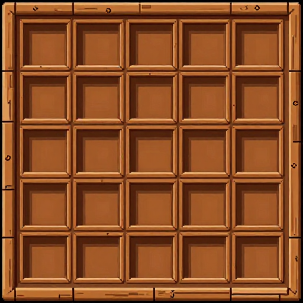

# 인벤토리 (Inventory)

Reference output generated on: 2026-04-18  
Reference workflow: z-image-turbo (ComfyUI)

---

### 🎒 인벤토리 패널 (Inventory Panel)

- **URL:** ../../outputs/comfyui-z-image-turbo/reference-images/204d0edd-3f6c-4f00-a9b3-681a2a9a3867.png
- **해상도:** 512×512
- **테마:** 나무 상자/창고 (Wooden Crate)
- **구성:** 4×5 빈 슬롯 그리드, 나무 프레임 외곽
- **Prompt:** 2D pixel art game UI inventory panel, wooden crate chest theme, grid of empty item slots 4x5 rows, each slot clearly separated by wood dividers, outer wooden frame border, retro RPG game HUD style, flat layout, warm brown earthy tones, clear grid cells visible, 512x512 resolution

### 🔲 인벤토리 슬롯 (Item Slot)

- **URL:** ../../outputs/comfyui-z-image-turbo/reference-images/e478068b-3ab5-4539-aa65-b9a131334cb1.png
- **해상도:** 128×128
- **테마:** 돌 프레임 (Stone Frame)
- **구성:** 단일 아이템 슬롯, 빈 내부 공간
- **Prompt:** 2D pixel art game UI single inventory item slot, stone frame square slot, raised bevel border pixel art, empty dark inner area for item icon, stone texture border, retro RPG game HUD style, flat layout, medieval gray tones, clear square slot shape, 128x128 resolution

---

| 종류 | 해상도 | 미리보기 |
|------|--------|---------|
| 인벤토리 패널 | 512×512 |  |
| 아이템 슬롯 | 128×128 |  |

← [목차로 돌아가기](../README.md)
---

## Metadata Prompts

| Image | Positive prompt | Seed | Model |
|---|---|---|---|
| `204d0edd-3f6c-4f00-a9b3-681a2a9a3867.png` | 2D pixel art game UI inventory panel, wooden crate chest theme, grid of empty item slots 4x5 rows, each slot clearly separated by wood dividers, outer wooden frame border, retro RPG game HUD style, flat layout, warm brown earthy tones, clear grid cells visible, 512x512 resolution | `3585428595` | `z_image_turbo_bf16.safetensors` |
| `e478068b-3ab5-4539-aa65-b9a131334cb1.png` | 2D pixel art game UI single inventory item slot, stone frame square slot, raised bevel border pixel art, empty dark inner area for item icon, worn stone texture border, retro RPG game HUD style, flat layout, medieval gray stone tones, clear square slot shape, 128x128 resolution | `1850598021` | `z_image_turbo_bf16.safetensors` |
