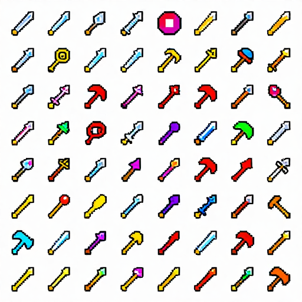
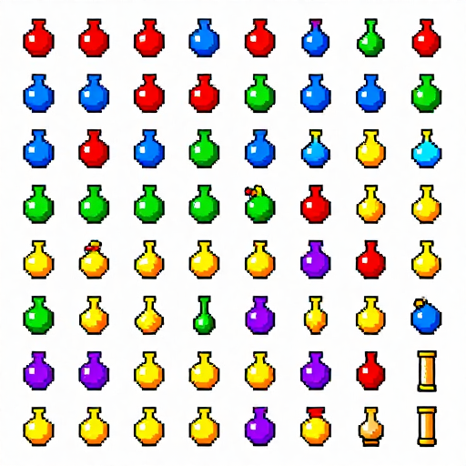
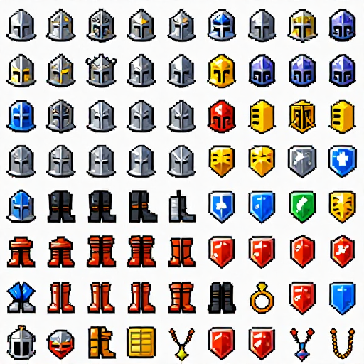
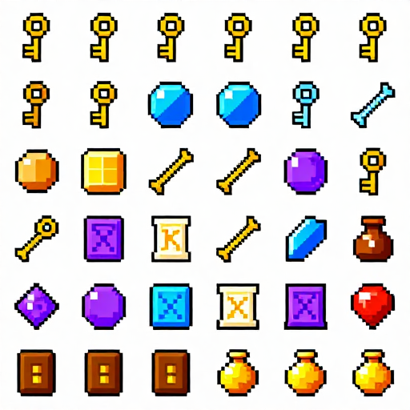

# 아이템 아이콘 시트 (Item Icon Sheets)

Reference output generated on: 2026-04-18  
Style: Classic RPG 16-bit pixel art icon grid  
Resolution: 512×512 | Reference workflow: z-image-turbo

---

### ⚔️ 무기 아이콘 (Weapons)

- **URL:** ../../outputs/comfyui-z-image-turbo/reference-images/690b46b7-71f7-4b83-b39c-2816aadbf34a.png
- **포함:** 검, 단검, 도끼, 활, 지팡이, 완드, 창, 해머
- **Prompt:** Weapon icon sheet, classic RPG 16-bit pixel art icon grid, sword dagger axe bow staff wand spear hammer, evenly spaced icons, clean inventory style, 512x512

### 🧪 포션 / 소모품 (Potions & Consumables)

- **URL:** ../../outputs/comfyui-z-image-turbo/reference-images/631ed397-794b-480d-b273-95407058e014.png
- **포함:** HP 포션(빨강), MP 포션(파랑), 해독제(초록), 만병통치약(노랑), 독(보라), 폭탄, 스크롤
- **Prompt:** Potion and consumable icon sheet, classic RPG 16-bit pixel art icon grid, red HP potion blue MP potion antidote elixir poison bomb scroll, clean inventory style, 512x512

### 🛡️ 방어구 / 장비 (Armor & Equipment)

- **URL:** ../../outputs/comfyui-z-image-turbo/reference-images/85f8d1ed-15e6-497f-a7b6-36a62827fa96.png
- **포함:** 투구, 갑옷, 부츠, 장갑, 반지, 목걸이, 방패
- **Prompt:** Armor equipment icon sheet, classic RPG 16-bit pixel art icon grid, helmet armor boots gloves ring necklace shield, neatly arranged icons, clean inventory style, 512x512

### 🗝️ 퀘스트 / 핵심 아이템 (Quest & Key Items)

- **URL:** ../../outputs/comfyui-z-image-turbo/reference-images/e523f718-c2fe-471d-b842-39775804f339.png
- **포함:** 황금 열쇠, 보물지도, 크리스탈 구슬, 고대 유물, 편지 스크롤, 보석, 동전 주머니
- **Prompt:** Quest and key item icon sheet, classic RPG 16-bit pixel art icon grid, golden key treasure map crystal orb ancient relic letter scroll gemstone coin pouch, neatly arranged, 512x512

---

| 종류 | 미리보기 |
|------|---------|
| ⚔️ 무기 |  |
| 🧪 포션/소모품 |  |
| 🛡️ 방어구/장비 |  |
| 🗝️ 퀘스트 아이템 |  |

← [목차로 돌아가기](../README.md)
---

## Metadata Prompts

| Image | Positive prompt | Seed | Model |
|---|---|---|---|
| `690b46b7-71f7-4b83-b39c-2816aadbf34a.png` | 2D pixel art game item icon sheet, classic RPG style, weapon icons grid, sword dagger axe bow staff wand spear hammer arranged in neat grid rows, vibrant colorful pixel art icons, 16-bit retro style, 512x512 | `2903427069` | `z_image_turbo_bf16.safetensors` |
| `631ed397-794b-480d-b273-95407058e014.png` | 2D pixel art game item icon sheet, classic RPG style, potion and consumable icons grid, red health potion blue mana potion green antidote yellow elixir purple poison bomb scroll arranged in neat grid, vibrant colorful pixel art icons, 16-bit retro style, 512x512 | `1731380273` | `z_image_turbo_bf16.safetensors` |
| `85f8d1ed-15e6-497f-a7b6-36a62827fa96.png` | 2D pixel art game item icon sheet, classic RPG style, armor and equipment icons grid, helmet chest armor boots gloves ring necklace shield arranged in neat grid rows, vibrant colorful pixel art icons, 16-bit retro style, 512x512 | `2389094093` | `z_image_turbo_bf16.safetensors` |
| `e523f718-c2fe-471d-b842-39775804f339.png` | 2D pixel art game item icon sheet, classic RPG style, quest and key item icons grid, golden key treasure map crystal orb ancient relic letter scroll gem coin bag arranged in neat grid, vibrant colorful pixel art icons, 16-bit retro style, 512x512 | `4185821098` | `z_image_turbo_bf16.safetensors` |
