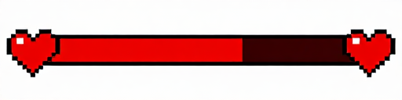
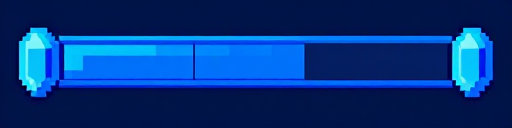

# 상태 바 (Status Bars)

Reference output generated on: 2026-04-18  
Resolution: 512×128 (가로형 바)  
Reference workflow: z-image-turbo (ComfyUI)

---

### ❤️ HP 바 (Health Bar)

- **URL:** ../../outputs/comfyui-z-image-turbo/reference-images/e7e32374-fc3d-48d5-b8fd-19dd960a02c0.png
- **색상:** 빨간색 (Red Crimson)
- **테마:** Heart / HP
- **Prompt:** 2D pixel art game UI health bar HP bar, red heart theme, horizontal wide bar shape, red filled portion showing full health on left, dark empty track on right, rounded pixel art end caps on both sides, retro RPG game HUD style, 9-slice sliceable bar design, red crimson tones, 512x128 resolution, flat layout

### 💙 MP 바 (Mana Bar)

- **URL:** ../../outputs/comfyui-z-image-turbo/reference-images/79f8c1b0-284b-4148-9e7f-ebdf84926273.png
- **색상:** 파란색 (Sapphire Blue)
- **테마:** Crystal / Mana
- **Prompt:** 2D pixel art game UI mana bar MP bar, blue crystal magic theme, horizontal wide bar shape, blue filled portion showing full mana on left, dark empty track on right, rounded pixel art end caps on both sides, retro RPG game HUD style, 9-slice sliceable bar design, deep blue sapphire tones, 512x128 resolution, flat layout

### 💛 EXP 바 (Experience Bar)

- **URL:** ../../outputs/comfyui-z-image-turbo/reference-images/440774db-dcd6-4905-acd3-143bb5793b25.png
- **색상:** 황금/연두 (Golden Yellow Green)
- **테마:** Star / Level-Up
- **Prompt:** 2D pixel art game UI experience bar EXP bar, golden star level-up theme, horizontal wide bar shape, golden filled portion showing full experience on left, dark empty track on right, rounded pixel art end caps on both sides, retro RPG game HUD style, 9-slice sliceable bar design, golden yellow green tones, 512x128 resolution, flat layout

---

| 종류 | 색상 | 미리보기 |
|------|------|---------|
| ❤️ HP | Red |  |
| 💙 MP | Blue |  |
| 💛 EXP | Yellow |  |

← [목차로 돌아가기](../README.md)
---

## Metadata Prompts

| Image | Positive prompt | Seed | Model |
|---|---|---|---|
| `e7e32374-fc3d-48d5-b8fd-19dd960a02c0.png` | 2D pixel art game UI health bar HP bar, red heart theme, horizontal wide bar shape, red filled portion showing full health on left, dark empty track on right, rounded pixel art end caps on both sides, retro RPG game HUD style, 9-slice sliceable bar design, red crimson tones, 512x128 resolution, flat layout | `2106332538` | `z_image_turbo_bf16.safetensors` |
| `79f8c1b0-284b-4148-9e7f-ebdf84926273.png` | 2D pixel art game UI mana bar MP bar, blue crystal magic theme, horizontal wide bar shape, blue filled portion showing full mana on left, dark empty track on right, rounded pixel art end caps on both sides, retro RPG game HUD style, 9-slice sliceable bar design, deep blue sapphire tones, 512x128 resolution, flat layout | `594617130` | `z_image_turbo_bf16.safetensors` |
| `440774db-dcd6-4905-acd3-143bb5793b25.png` | 2D pixel art game UI experience bar EXP bar, golden star level-up theme, horizontal wide bar shape, yellow green filled portion showing experience progress on left, dark empty track on right, rounded pixel art end caps on both sides, retro RPG game HUD style, 9-slice sliceable bar design, golden yellow green tones, 512x128 resolution, flat layout | `3099662369` | `z_image_turbo_bf16.safetensors` |
