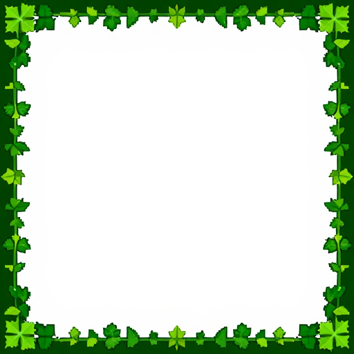
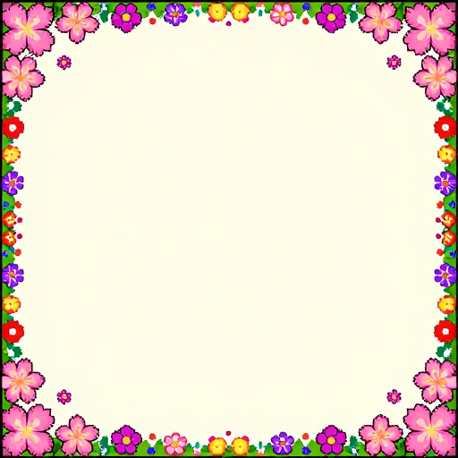
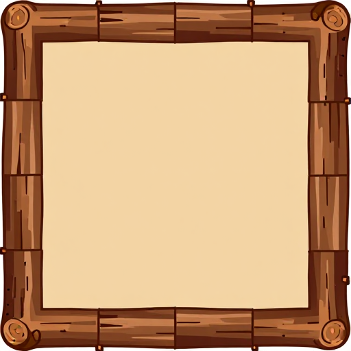
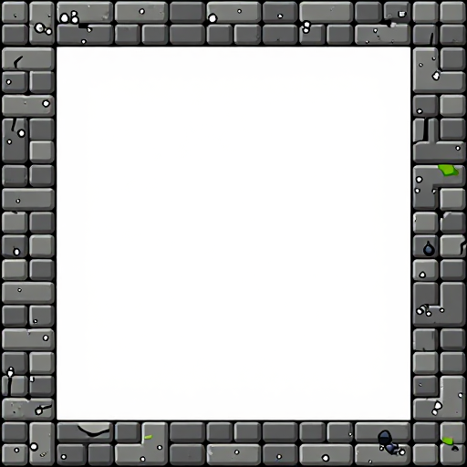
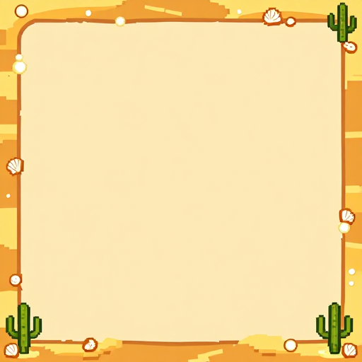
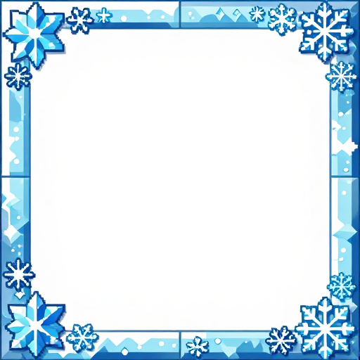
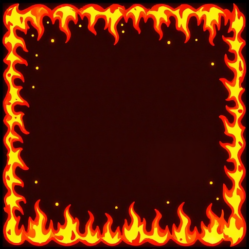
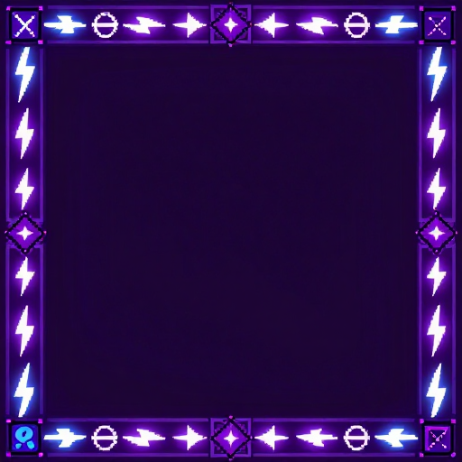
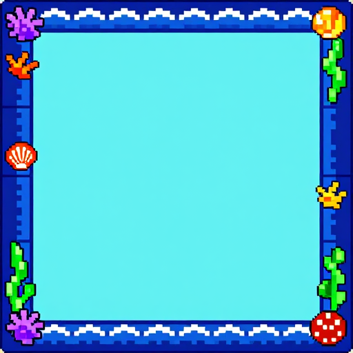
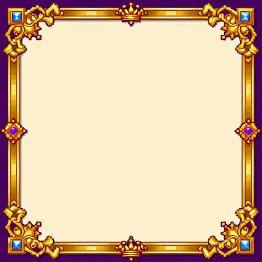

# 2D Pixel Art UI Panels (9-Slice / Border-Image)

Reference output generated on: 2026-04-18  
Resolution: 512×512 | Reference workflow: z-image-turbo (ComfyUI)

---

## 자연 테마 5종

| 테마 | 미리보기 |
|------|---------|
| 🌿 식물 / 덩굴 |  |
| 🌸 꽃 / 벚꽃 |  |
| 🪵 나무 / 목재 |  |
| 🪨 돌 / 석재 |  |
| 🏜️ 모래 / 사막 |  |

Prompt template:

`2D pixel art game UI panel, 9-slice border-image style, {theme} theme, {decoration} decorating all four corners and edges, empty clean {center color} center area for content, thick decorative {theme} border, retro RPG game HUD style, flat layout, clear corner pieces and edge tiles visible, {palette}, 512x512`

---

## 신규 테마 5종

### ❄️ 얼음 (Ice & Snow)

- **URL:** ../../outputs/comfyui-z-image-turbo/reference-images/283be3c0-57e8-49fc-afa3-a544214b239a.png
- **Prompt:** 2D pixel art game UI panel, 9-slice border-image style, ice and snow theme, ice crystals and snowflakes decorating all four corners and edges, empty clean pale blue center area for content, thick decorative frozen border, retro RPG game HUD style, flat layout, clear corner pieces and edge tiles visible, cool blue white tones, 512x512

### 🔥 화염 (Fire & Flame)

- **URL:** ../../outputs/comfyui-z-image-turbo/reference-images/6dffb55d-d40e-4e0e-8fc7-5a672a5fcecb.png
- **Prompt:** 2D pixel art game UI panel, 9-slice border-image style, fire and flame theme, flames and embers decorating all four corners and edges, empty clean warm cream center area for content, thick decorative blazing border, retro RPG game HUD style, flat layout, clear corner pieces and edge tiles visible, hot red orange tones, 512x512

### ⚡ 마법 (Magic & Arcane)

- **URL:** ../../outputs/comfyui-z-image-turbo/reference-images/1d2553ae-2bbd-4585-ade6-6d039a89151e.png
- **Prompt:** 2D pixel art game UI panel, 9-slice border-image style, magic and arcane theme, arcane runes and lightning bolts decorating all four corners and edges, empty clean pale center area for content, thick decorative mystical border, retro RPG game HUD style, flat layout, clear corner pieces and edge tiles visible, electric purple blue tones, 512x512

### 🌊 바다 (Ocean & Sea)

- **URL:** ../../outputs/comfyui-z-image-turbo/reference-images/e50f16f9-66e3-483c-b0fa-be727709163f.png
- **Prompt:** 2D pixel art game UI panel, 9-slice border-image style, ocean and sea theme, waves coral and seashells decorating all four corners and edges, empty clean light aqua center area for content, thick decorative ocean border, retro RPG game HUD style, flat layout, clear corner pieces and edge tiles visible, deep blue aqua tones, 512x512

### 👑 왕실 (Royal & Gold)

- **URL:** ../../outputs/comfyui-z-image-turbo/reference-images/8b01723e-93ae-4683-b2f9-277a0f443b3a.png
- **Prompt:** 2D pixel art game UI panel, 9-slice border-image style, royal gold theme, ornate filigree and crown motifs decorating all four corners and edges, empty clean ivory center area for content, thick decorative royal border, retro RPG game HUD style, flat layout, clear corner pieces and edge tiles visible, rich gold purple tones, 512x512

← [목차로 돌아가기](../README.md)
---

## Metadata Prompts

| Image | Positive prompt | Seed | Model |
|---|---|---|---|
| `43117e0c-8ebb-46ee-8e0f-b0a7434292c3.png` | 2D pixel art game UI panel, 9-slice border-image style, vine and plant theme, green ivy vines and leaves decorating all four corners and edges, empty clean white center area for content, thick decorative botanical border, retro RPG game HUD style, top-down view flat layout, clear corner pieces and edge tiles visible, 512x512 | `2790541007` | `z_image_turbo_bf16.safetensors` |
| `b1673f37-1501-4c0e-9fdb-7b11ed71e67b.png` | 2D pixel art game UI panel, 9-slice border-image style, flower blossom theme, pink cherry blossoms and colorful wildflowers decorating all four corners and edges, empty clean light center area for content, thick decorative floral border, retro RPG game HUD style, flat layout, clear corner pieces and edge tiles visible, pastel colors, 512x512 | `3380992145` | `z_image_turbo_bf16.safetensors` |
| `3a31a245-9490-4eb9-ba05-59d450aa363e.png` | 2D pixel art game UI panel, 9-slice border-image style, wooden tree log theme, brown bark wood planks and tree knots decorating all four corners and edges, empty clean beige center area for content, thick decorative wood frame border, retro RPG game HUD style, flat layout, clear corner pieces and edge tiles, rustic earthy colors, 512x512 | `1467829623` | `z_image_turbo_bf16.safetensors` |
| `229c94a9-61ae-404b-8bd0-ece3fe03fa27.png` | 2D pixel art game UI panel, 9-slice border-image style, stone brick and rock theme, gray mossy stone bricks and pebbles decorating all four corners and edges, empty clean light center area for content, thick decorative stone wall border, retro RPG game HUD dungeon style, flat layout, clear corner pieces and edge tiles, medieval gray tones, 512x512 | `4034717130` | `z_image_turbo_bf16.safetensors` |
| `0852a63f-fa69-4b15-a751-6d8d22574623.png` | 2D pixel art game UI panel, 9-slice border-image style, desert sand theme, golden sandy dunes and small cacti and seashells decorating all four corners and edges, empty clean warm beige center area for content, thick decorative sandy border, retro RPG game HUD desert style, flat layout, clear corner pieces and edge tiles, warm sandy golden tones, 512x512 | `1291463412` | `z_image_turbo_bf16.safetensors` |
| `283be3c0-57e8-49fc-afa3-a544214b239a.png` | 2D pixel art game UI panel, 9-slice border-image style, ice and snow crystal theme, ice crystals and snowflakes decorating all four corners and edges, empty clean cool white center area for content, thick decorative ice border, retro RPG game HUD style, flat layout, clear corner pieces and edge tiles visible, cool blue white silver tones, 512x512 | `3125790887` | `z_image_turbo_bf16.safetensors` |
| `6dffb55d-d40e-4e0e-8fc7-5a672a5fcecb.png` | 2D pixel art game UI panel, 9-slice border-image style, fire and flame theme, fire flames and embers and ash decorating all four corners and edges, empty clean warm dark center area for content, thick decorative flame border, retro RPG game HUD style, flat layout, clear corner pieces and edge tiles visible, hot red orange yellow tones, 512x512 | `2685603567` | `z_image_turbo_bf16.safetensors` |
| `1d2553ae-2bbd-4585-ade6-6d039a89151e.png` | 2D pixel art game UI panel, 9-slice border-image style, magic arcane theme, lightning bolts arcane runes and mystical symbols decorating all four corners and edges, empty clean dark purple center area for content, thick decorative arcane border, retro RPG game HUD style, flat layout, clear corner pieces and edge tiles visible, electric purple blue tones, 512x512 | `1534932796` | `z_image_turbo_bf16.safetensors` |
| `e50f16f9-66e3-483c-b0fa-be727709163f.png` | 2D pixel art game UI panel, 9-slice border-image style, ocean and sea theme, ocean waves coral shells and seaweed decorating all four corners and edges, empty clean aqua blue center area for content, thick decorative ocean border, retro RPG game HUD style, flat layout, clear corner pieces and edge tiles visible, deep blue aqua teal tones, 512x512 | `1311210170` | `z_image_turbo_bf16.safetensors` |
| `8b01723e-93ae-4683-b2f9-277a0f443b3a.png` | 2D pixel art game UI panel, 9-slice border-image style, royal gold theme, ornate gold filigree and royal crown jewel decorating all four corners and edges, empty clean regal center area for content, thick decorative royal gold border, retro RPG game HUD style, flat layout, clear corner pieces and edge tiles visible, rich gold purple royal tones, 512x512 | `2784155097` | `z_image_turbo_bf16.safetensors` |
